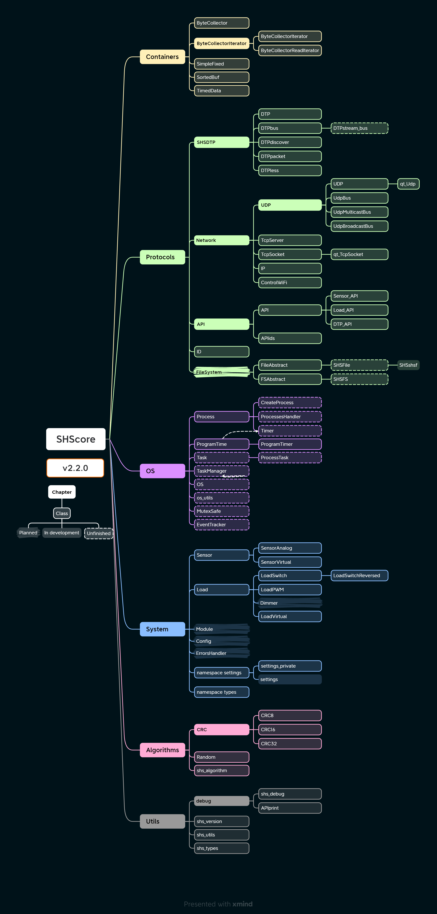
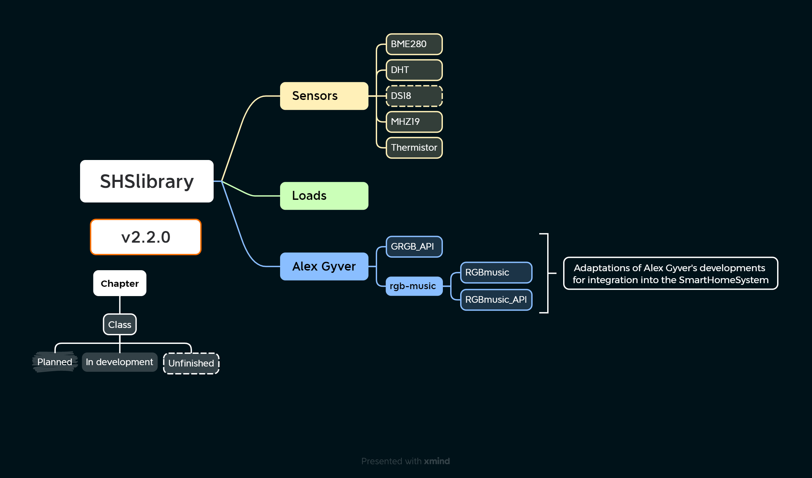
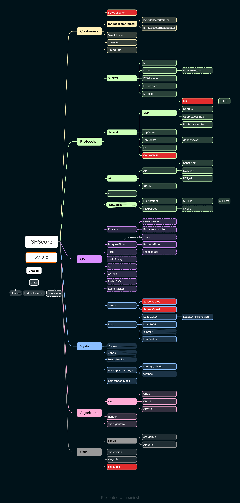

---

# Versions

<!---------------------------------- v0.1.0 ----------------------------------->

v0.1.0 — private beta-version.

<!---------------------------------- v0.2.0 ----------------------------------->

v0.2.0 — development.

<!---------------------------------- v1.0.0 ----------------------------------->

v1.0.0 — release.

- [See release](https://github.com/MrRyabena/SmartHomeSystem/releases/tag/v1.x.x)
- New core architecture.
- New library.
- The documentation has been completed.
- The SHScore has not been tested.
- The demo version is incomplete.
- Tests and additions are expected.

<!---------------------------------- v1.1.0 ----------------------------------->

v1.1.0 — added tests.

- Tests have been written and conducted, created the library SHStests.
- A random number generator (shs::Random) has been created.
- Development of a project assembly system.
- shs::ByteCollecor: fixed a critical error in functions get() and reserve().
- shs::CRC: now the function crcBuf(..) writes the result to a variable crc.
- The synchronizer has been replaced with a make.sh.

<!---------------------------------- v1.2.0 ----------------------------------->

v1.2.0 — intermediate version.

- A file system has been developed `[beta]`:
  - shs::FSAbstract and shs::FileAbstract — interface classes.
  - shs::FS — file system class.
  - shs::File — file class.
  - shs::SHSF — `[beta]` Smart Home System File (.shsf). It has errors now. 
    _*note: The File System is poorly tested and isn't fully developed.*_
- Developed a new ID-type SHSID.
- Added SHSversion.h.
- An important version for the further development of the project.

<!---------------------------------- v2.0.0 ----------------------------------->

v2.0.0 — global update.

<!-- # SmartHomeSystem v2.0.0 Release Notes -->

- **Build System**: Completed a comprehensive project build system using CMake and Shell.
- **Data Structures and Algorithms**: Added algorithms and containers for working with ordered data:
  - `shs::SortedBuf`: A container for working with ordered `std::vector`.
  - `shs_algorithms`: Template functions for searching, inserting, and deleting elements in containers.
- **Memory Management**: Improved memory handling with added move semantics.
- **SHSDTP Module**: Major changes, divided into components and expanded:
  - Component classes:
    - `shs::DTP`: A container class for linking data buses and API handlers.
    - `shs::DTPbus`: An abstract class for a data bus that accepts and sends messages.
    - `shs::DTPdiscover`: A class for discovering devices on a local network.
    - `shs::DTPless`: Comparison operators for search and sorting algorithms.
    - `shs::DTPpacket`: A class for creating, encrypting, and decrypting messages.
  - Fully tested.
- **Program Time**: Function names have been changed, optimized, bugs fixed, and tested.
- **Fixed-Point Numbers**: Created `shs::SimpleFixed`, a temporary implementation for convenience.
- **Network Module**:
  - Updated and debugged `shs::ControlWiFi`.
  - Added `shs::IP` class for storing and working with IP addresses.
  - Created and tested classes for working with Qt sockets:
    - `shs::qt::TcpSocket`
    - `shs::qt::UdpSocket`
  - `shs::TcpServer`: Updated functionality, debugged, and tested.
    - Automatically attaches clients to `shs::DTP`.
    - Configures clients to delete when the connection is closed.
  - `shs::TcpSocket`: Updated functionality, debugged, and tested.
    - Based on `shs::DTPbus`.
    - Automatic reconnection in case of connection loss.
    - Qt support.
  - **UDP Support**:
    - Created `shs::UDP`, providing an interface for working with UDP.
    - `shs::UdpBus`: Works with UDP as with `shs::DTPbus`.
    - `shs::UdpBroadcastBus`: Sending and receiving broadcast messages.
    - `shs::UdpMulticastBus`: Sending and receiving messages in a group.
- **Load Components**: Redesigned, debugged, and tested.
- **Types Module**: Developed from `shs_settings_private.h`.
- **Sensor Module**:
  - Redesigned, debugged, and tested.
  - Functionality changes:
    - `update()` must be called before getting the value.
    - `updateFast()`, if supported by the sensor, measures less accurately but faster.
    - Added error status.
    - Support for multiple metrics.
- **Library Updates**:
  - The library has been expanded and now includes new components:
    - **GRGB API**: An API for working with GRGB (from AlexGyver's library).
    - **RGB Color Music Library**: A library for managing RGB color music effects.
    - **Sensor Support**: Added support for various sensor types:
      - `BME280`
      - `DHT`
      - `DS18`
      - `MHZ19`
      - `Thermistor`
      - `SensorTypes`: An enumeration for different sensor types.
- **Undebugged Components**:
  - `shs::StreamBus`: Not debugged, has bugs. Support and development expected in future versions.
  - `shs::EventTracker`: Has bugs and errors.
- **Unused Components**:
  - `shs::CreateProcess`: The class creates a process from function pointer templates.
  - `shs::MutexSafe`: Component of an unused OS module.
- **Underdeveloped Components**:
  - `shs::Time`: Unix time storage and parsing (not developed).

Changes ([see also here](./schemes/SHScore-changes/SHScore-changes-v1_2_0.png))

<!---------------------------------- v2.1.0 ----------------------------------->

v2.1.0 — The core functionality has been expanded; sensor libraries have been debugged and tested; added a new device <i>ClimateStation</i>.

<!-- # SmartHomeSystem v2.1.0 Release Notes -->

### SHScore

- **Changes:**
  - `shs::ByteCollector`: Optimization and bugs fix.
  - `shs::ID`: Fixed a bug during the assignment of ID components.
  - `shs::version::Version`: Added compare operators.
  - `shs::SensorAnalog`: Updated according to the changes in the base class.
  - `shs::SimpleFixed`: Added copy constructors and assignment operators.
- **New functional:**
  - `shs::LoadPWM`: Returned to development, redesigned, debugged and tested.
  - `shs::ProgramTimer`: A class has been created for timers inside the program code.
- **Bugs:**
  - `shs::DTP_API`: Critical error found. The error has not been fixed, the use of this class is unsafe!
  - `shs::TcpSocket`: It has bugs related to shs::DTP_API. Temporary fixes have been made.

### SHSlibrary

- **Changes:**
  - `shs::Thermistor`: Fixed bugs, tested.
  - `shs::GRGB_API`: Fixed bugs, tested.
  - `shs::DS18`: Completed, but need testing.

### Other

- Updated logos.
- Work on the ClimateStation project has been completed.

<!----------------------------------------------------------------------------->

<!---------------------------------- v2.2.0 ----------------------------------->

v2.2.X — <code><b>[current]</b></code> SHScore has been optimized and debugged. Deprecated code has been removed. Documentation has been updated.

### Patches:
- **v2.2.0** — basic.
- **v2.2.1** — **`[current]`** 
  - Fixed critical bug in `examples/guide_system/make.sh`.
  - Updated `make.sh` for copy shs_settings.h in qt-build.
  - Added about the settings file and dependencies in `build_manual.md`.
  - Removed deprecated shell-script.

<!-- # SmartHomeSystem v2.2.0 Release Notes -->

### SHScore

- **Changes:**
  - `shs::ByteCollector`:
    - optimized.
    - removed c-style casts.
    - added private functions `m_shift_right()` and `m_shift_left()`.
    - optimized `insert()`.
  - `shs::ControlWiFi`: 
      - Updated, prepared for expansion of functionality.
      - The definition of functions is moved to the implementation file.
  - `shs::SensorVirtual`:
    - Bug fixed: updated according to changes in the base class   `shs::Sensor`.
  - `shs::SensorAnalog`:
    - Fixed a bug in function getCacheExpiration().
  - `shs::UDP`:
    - Fixed conditional compilation bug.
  - `shs::types`:
    - Correct work with `shs_settings.h`.
- **Bugs:**
  - `shs::DTP_API`: **`[from v2.1.0]`** Critical error found. The error has not been fixed, the use of this class is unsafe!
  - `shs::TcpSocket`: **`[from v2.1.0]`** It has bugs related to shs::DTP_API. Temporary fixes have been made.

### Build:
- Added shs_settings_template for creating shs_settings.h.

### Examples
  - Created ControlWiFi-example.

### SHSdocumentation

- **Changes:**
  - Some corrections in main `README.md`.
  - `system_creation_guide.md` has been rewritten and updated.

  

<!----------------------------------------------------------------------------->

---
> [!NOTE]
>
> - Вся документация переехала в папку [SHSdocumentation](SHSdocumentation/). Единая статья из `v1.X.X` разделена на тематические файлы и папки и дополнена.
> - У **_SmartHomeSystem_** есть [блог разработки](https://t.me/SmartHomeSystem_dev), там можно наблюдать за развитием проекта.
> - Пример создания автоматизированной системы, используя фреймворк **_SmartHomeSystem_** можно посмотреть в [system_creation_guide](/SHSdocumentation/Usage/system_creation_guide.md).

> [!IMPORTANT]
> 
> На основе ядра и библиотек **_SmartHomeSystem_** разработано несколько устройств, которые тоже относятся к проекту, но для удобства их разработка ведется в отдельных репозиториях. В разделе [SmartHomeSystem Projects](#smarthomesystem-projects) можно кратко ознакомиться с устройствами и посетить соответствующие репозитории.

---

## Содержание

- [Структура репозитория](#структура-репозитория)
- [Краткий обзор](#краткий-обзор)
  - [В проект <b><i>SmartHomeSystem</b></i> входят](#в-проект-smarthomesystem-входят)
    - [SHScore](#shscore)
    - [SHSlibrary](#shslibrary)
  - [Сборка, использование, документация](#сборка-использование-документация)
  - [Сферы применения](#сферы-применения)
- [SmartHomeSystem Projects](#smarthomesystem-projects)
- [Достижения проекта](#достижения-проекта)
- [Источники информации и литература](#источники-информации-и-литература)
- [Благодарности](#багодарности)
- [Contacts](#contacts)

## Структура репозитория

Проект выложен в репозитории на GitHub и доступен по ссылке: <https://github.com/MrRyabena/SmartHomeSystem>. 

- [awards](./awards/) — награды проекта (дипломы, документы, фотографии).
- [SHSdocumentation](SHSdocumentation/) — документация к проекту.
  - [Code](SHSdocumentation/Code/) — документация к программному коду.
  - [Hardware](SHSdocumentation/Hardware/) — рекомендации по подбору компонентной базы (датчики, микроконтроллеры, технические устройства).
  - [ProjectOverview](SHSdocumentation/ProjectOverview/) — обзор проекта, особенности разработки, методы и подходы.
  - [Usage](SHSdocumentation/Usage/) — руководства по сборке библиотек и использованию Smart HomeSystem, информация для пользователей и разработчиков.
- [pitch](pitch/) — презентации проекта и вспомогательные файлы.
- [schemes](schemes/) — картинки, схемы, чертежи...
- [SHSlogos](SHSlogos/) — логотипы и символика проекта.
- [src](src/) — исходный код.
  - [examples](src/examples/) — примеры использования программного кода.
  - [SHSapp](src/SHSapp%20[beta]) — разработки графических приложений.
  - [SHScore](src/SHScore/) — ядро (бизнес-логика), основная разработка.
  - [SHSlibrary](src/SHSlibrary/) — основанная на ядре библиотека с инструментами, интерфейсами датчиков и нагрузок, вычислительными алгоритмами.
  - [SHSqt_core](src/SHSqt_core/) — ядро для фреймворка Qt.
  - [SHSsettings](src/SHSsettings) — настройки компиляции исходников.
  - [make.sh](src/make.sh) — Shell-скрипт для сборки всех исходников проекта (см. документацию по использованию: [build_manual](./SHSdocumentation/Usage/build_manual.md)).
> [!WARNING]
> Файл make.sh является shell-скриптом и не имеет отношения к системе сборки `make`. Чтобы не вводить пользователей в заблуждение в последующих обновлениях подобные файлы будут переименованы. 

## Краткий обзор

**_SmartHomeSystem_** — кроссплатформенный фреймворк, который упрощает создание автоматизированных систем для решения комплексных задач. Проект предлагает программные инструменты и технические решения для разработки модульных систем, способных быстро изменять свою конфигурацию. Алгоритмы и логика ПО позволяют как создавать цельные автоматизированные системы, так и использовать выборочные части кода в других проектах и standalone-устройствах.

### В проект <b><i>SmartHomeSystem</b></i> входят

- **Технические разработки**
  - Компонентная база ([см SHSdocumentation/Hardware](/SHSdocumentation/Hardware/))
  - Схемы, платы, чертежи устройств и модулей
  - 3D-модели корпусов и деталей модулей (см. репозитории отдельных устройств)
- **Программные разработки**
  - Кроссплатформенное ядро ([SHScore](/src/SHScore/))
  - Библиотеки для работы с устройствами и алгоритмами [SHSlibrary](/src/SHSlibrary/)
  - Прошивки для микроконтроллеров
  - **`[unfinished]`** GUI приложения ([SHSapp](/src/SHSapp%20[beta]/))
  - **`[planned]`** Тесты
  - **`[unfinished]`** Examples
- **Разработки устройств**
  - Вынесены в отдельные репозитории
  - Принципиальные электрические схемы для сборки
  - Гербер-файлы печатных плат
  - 3D-модели корпусов
  - Дополнительная информация по алгоритмам сборки и настройки
- **Документация**
  - Рекомендации по разработке аппаратной части
  - Документация к коду ([SHSdocumentation/Code](/SHSdocumentation/Code/))
  - Инструкция по сборке и использованию программной части ([SHSdocumentation/Usage](/SHSdocumentation/Usage/))
  - Руководства по проектированию собственных устройств

---

#### SHScore

Ядро **_SmartHomeSystem_** реализует основные функции проекта и на данный момент включает в себя следующие ключевые разработки:

- контейнеры для хранения и представления данных
- инструменты для работы с окружением операционных систем
- стандарты представления и передачи данных
- абстракции датчиков и нагрузок
- утилиты и алгоритмы автоматизации
- алгоритмы управления и взаимодействия устройств, API

Схема ядра ([see also here](./schemes/SHScore-scheme.pdf)):

---

#### SHSlibrary

SHSlibrary содержит набор библиотек для работы с конкретными датчиками, нагрузками и алгоритмами.

Схема библиотеки ([see also here](./schemes/SHSlibrary-scheme.pdf)):

---

### Сборка, использование, документация

Инструкции по сборке проекта находятся в папке документации ([SHSdocumentation](/SHSdocumentation/)) в разделе [Usage](/SHSdocumentation/Usage/). Там же есть гайд по созданию систем, используя фреймворк **_SmartHomeSystem_**.

> [!TIP]
> Рекомендуется внимательно ознакомиться со всей [документацией](/SHSdocumentation/). В её папке в соответствующем [README](/SHSdocumentation/README.md) описан порядок чтения разделов документации.

### Сферы применения

- Создание систем "Умный дом": автоматизация управления освещением, микроклиматом и бытовыми приборами для повышения комфорта и энергоэффективности.
- Автоматизация производственных и бизнес-процессов: оптимизация работы оборудования и управление производственными линиями для повышения эффективности.
- Разработка специализированных решений для управления и мониторинга: использование в научных исследованиях для создания систем датчиков и мониторинга.
- Умные офисы: автоматизация управления освещением, климатом и системами безопасности для повышения комфорта и продуктивности сотрудников.
- Сценические эффекты и динамические инсталляции: управление прожекторами, дымогенераторами, создание эффектов для уникальных визуальных представлений на мероприятиях и инсталляциях.
- Фото и видеоиндустрия: управление системой источников света и художественных эффектов во время съемок для создания уникальных материалов.
- Образовательные учреждения: создание интерактивных учебных лабораторных проектов, наборов для проведения и мониторинга экспериментов.
- Сельское хозяйство: автоматизация процессов полива, контроля температуры и влажности воздуха и почвы для повышения урожайности.

## SmartHomeSystem Projects

> [!IMPORTANT]
> Далее перечислены проекты, которые являются частью **_SmartHomeSystem_**, но для удобства разработки вынесены в отдельные репозитории.

- [SmartSpot](https://github.com/MrRyabena/SmartSpot) — мощный светодиодный RGB-прожектор, управляющийся по WiFi через API с помощью GUI-приложения, Telegram-бота или кастомного пользовательского клиента. Светильник поддерживает различные эффекты, есть возможность объединить несколько спотов в группу, для мощного освещения сцены, фотозоны или других объектов. Несколько созданных светильников применяются в качестве сценического света, для проведения дискотек (имеется встроенная цветомузыка) и разработки тематических игр (в отдельной ветке проекта реализована игра Мафия, с тематической озвучкой и светоэффектами). Проект реализован и многократно испытан группой разработчиков SmartHomeSystem.

   

- [ClimateStation](https://github.com/MrRyabena/ClimateStation) — метеостанция в специально разработанном для 3D-печати корпусе с сенсорным дисплеем. Собирает информацию с внутренних и внешних датчиков об атмосферном давлении, уровне CO2 (углекислого газа) в помещении, влажности и температуре воздуха. Станция умеет составлять прогноз погоды, подсказывать когда необходимо проветрить помещение и выводить показания с датчиков и графики их изменений. Сенсорный экран позволяет изменять настройки, переключать режимы работы и смотреть показания датчиков в реальном времени. Также устройство может обеспечивать обратную связь в системах климат-контроля **_SmartHomeSystem_**.

    

- [SmartBank](https://github.com/MrRyabena/SmartBank) — умная копилка, которая станет уникальным украшением в интерьере. Была создана во время хакатона "Умный Петербург 2025", по результатам которого заняла 1 место.**SmartBank** умеет распознавать номиналы монет, подсчитывать сумму, собирать статистику и выводить данные на экране и в Telegram чате. Устройство создано на основе ядра **_SmartHomeSystem_** для работы standalone или интеграции в системы умного дома.
  
      

## Достижения проекта

> [!NOTE]
> Описания достижений, дипломы, грамоты, фотографии и другие документы находятся в папке [awards](./awards) и в соответствующем README. Ниже представлено несколько наиболее значимых достижений **_SmartHomeSystem_**.

## 2 место в Всероссийском конкурсе open source проектов

## 1 место в хакатоне "Умный Петербург 2025"

[SmartBank](https://github.com/MrRyabena/SmartBank), созданная на хакатоне "Умный Петербург 2025" как решение кейса от Санкт-Петербургского политехнического университета Петра Великого, заняла первое место в треке "Интернет вещей". За 2 дня наша команда смоделировала и напечатала корпус, собрала электронику, написала программный код и отладила механизм распознавания монет.

---

## Источники информации и литература

См.: [/SHSdocumentation/ProjectOverview/2_literature.md](/SHSdocumentation/ProjectOverview/2_literature.md)

---

## Багодарности

Автор выражает благодарность:

- [AlexGyver'у](https://github.com/AlexGyver) (блогер и open source DIY разработчик), проекты которого послужили источником знаний и вдохновения для создания **_SmartHomeSystem_**.
- [Ивану Макарову](https://github.com/i-s-m-mipt) (преподаватель и ведущий программист-разработчик лаборатории МФТИ), лекции которого дали много полезных и глубоких знаний в области языка программирования C++.

---

## Contacts

Tg: <https://t.me/MrRyabena> 
Mail: <daniilrazanov82349@gmail.com> 
Development blog: <https://t.me/SmartHomeSystem_dev> 
 
_**I will be glad to receive suggestions for improving the project, cooperation, and feedback.**_ 
 
Daniil Ryazanov (Даниил Рязанов) 
_Saint-Petersburg, 2025_ 
