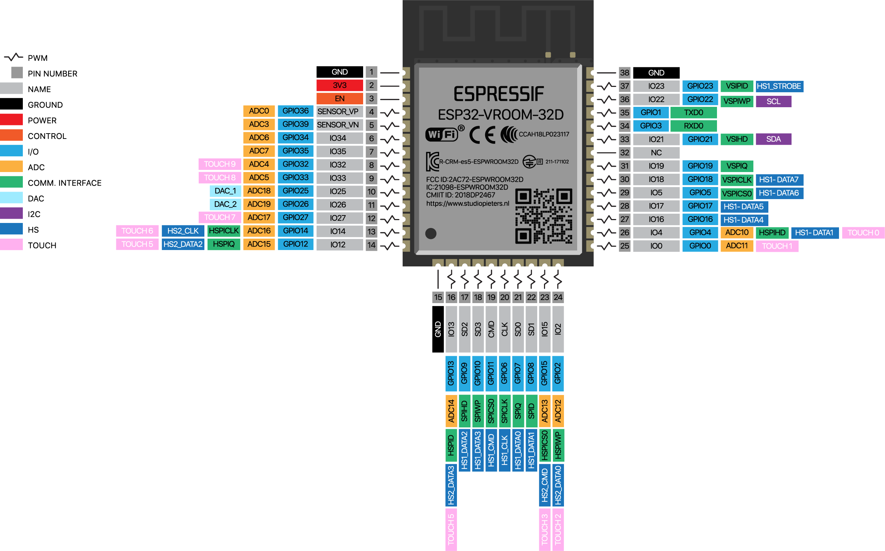

# SmartHomeSystem

<!-- <pre> -->
```c++
/*
   _____                      _     _    _                         _____           _                   
  / ____|                    | |   | |  | |                       / ____|         | |                  
 | (___  _ __ ___   __ _ _ __| |_  | |__| | ___  _ __ ___   ___  | (___  _   _ ___| |_ ___ _ __ ___    
  \___ \| '_ ` _ \ / _` | '__| __| |  __  |/ _ \| '_ ` _ \ / _ \  \___ \| | | / __| __/ _ \ '_ ` _ \   
  ____) | | | | | | (_| | |  | |_  | |  | | (_) | | | | | |  __/  ____) | |_| \__ \ ||  __/ | | | | |  
 |_____/|_| |_| |_|\__,_|_|   \__| |_|  |_|\___/|_| |_| |_|\___| |_____/ \__, |___/\__\___|_| |_| |_|  
                                                                          __/ |                      
                                                                         |___/                       
*/
```
<!-- </pre> -->

# Note

### <u>Проект в разработке, архитектура ядра, документация и концепции постоянно меняются и дорабатываются. Полная картина будет понятна ближе к релизу.</u>

---
<a id="versions"></a>

_Ожидаемая дата релиза:_ 05.03.2024

# Versions

- v1.0.0 — private beta-version.
- **v1.1.0 — [current version] development.**

### Announcements

- v1.2.0 — release.
  - New core architecture.
  - New library.
  - Documentation will be updated.


---

# Содержание

- [1. Введение](#1_introduction)
  - [1.1 Микроэлектроника уже повсюду](#1-1_microchip)
  - [1.2 Актуальность и обоснование проекта](#1-2_relevance)
  - [1.3 Цели и задачи](#1-3_purposes)
- [2. Обзор литературы](#2_literature)
  - [2.1 Alex Gyver](#2-1_alexgyver)
  - [2.2 Виктор Петин](#2-2_petin)
  - [2.3 Нил Кэмерон](#2-3_cameron)
- [3. Структура проекта](#3_struct)
- [4. Методы и этапы проектирования](#4_methods_stages)
  - [4.1 Принцип работы](#4-1_principle)
  - [4.2 Этапы разработки](#4-2_stages)
  - [4.3 Подход к проектированию](#4-3_design_approach)
  - [4.4 Функции](#4-4_functions)
  - [4.5 Структура Smart Home System](#4-5_structSHS)
- [5. Выбор компонентов](#5_choice)
  - [5.1 Микроконтроллеры](#5-1_microcontrollers)
    - [5.1.1 Atmega328P](#5-1-1_atmega328p)
    - [5.1.2 ESP8266](#5-1-2_esp8266)
    - [5.1.3 ESP32](#5-1-3_esp32)
  - [5.2 Датчики](#5-2_sensors)
    - [5.2.1 Temperature](#5-2-1_temperature)
    - [5.2.2 Humidity](#5-2-2_humidity)
    - [5.2.3 Pressure](#5-2-3_pressure)
    - [5.2.4 Carbon dioxide](#5-2-4_carbon-dioxide)
    - [5.2.5 Illumination](#5-2-5_illumination)
    - [5.2.6 Other](#5-2-6_other)
  - [5.3 Силовые компоненты](#5-3_load)
    - [5.3.1 Транзисторы](#5-3-1_transistor)
    - [5.3.2 Симисторы](#5-3-2_triac)
  - [5.4 Обвязка](#5-4_strapping)
    - [5.4.1 Резисторы](#5-4-1_resistor)
    - [5.4.2 Конденсаторы](#5-4-2_capacitor)
    - [5.4.3 Диоды](#5-4-3_diode)
    - [5.4.4 Стабилитроны](#5-4-4_zener-diode)
    - [5.4.5 Стабилизаторы напряжения](#5-4-5_stabilizer)
    - [5.4.6 Оптопары (оптроны)](#5-4-6_optocoupler)
    - [5.4.7 Регистры](#5-4-7_register)
- [6. Этап I](#6_stageI)
  - [6.1 Module](#6-1_module)
  - [6.2 Управление нагрузкой]()
  - [6.3 Датчики]()

- [7. Этап II](#stageII)
  - [7.1 Организация соединения](#connection-organization)
    - [7.1.1 Покрытие сети](#network-coverage)
    - [7.1.2 Подключение модулей](#connecting-modules)
    - [7.1.3 TCP/IP](#623-tcpip)
- [8. Этап III](#stageIII)
- [9. Этап IV](#stageIV)
- [10. Этап V](#stageV)
- [Версии](#versions)
- [Источники информации](#sources)

<a id="1_introduction"></a>

# 1. Введение

<a id="1-1_microchip"></a>

## 1.1 Микроэлектроника вокруг нас

Мы живем в эпоху кремниевой лихорадки, когда на каждом шагу нас окружает огромное количество высокотехнологичных устройств с микрочипами внутри. Даже самые обыденные бытовые приборы, такие как электрочайник, светодиодная лампа или обогреватель, оказываются оборудованы умными «мозгами», превращая наши дома в настоящие технологические чудеса. Что уж там говорить про различные смартфоны, компьютеры, серверы… Такая широкая массовая распространенность микроэлетроники привела к росту уровня технологий и увеличению масштабов производства. Появилось много микросхем, доступных обычным радиолюбителям. Сейчас, всего за цену одной порции шаурмы можно заказать из Поднебесной модуль, способный решать задачи с эффективностью компьютера на i486 (процессор Intel 80486, 1989г.), при этом сам он поместится в чайной ложке!</br>

Системой умного дома сейчас мало кого можно удивить. На рынке представлены промышленные решения от именитых брендов. Компании готовы спроектировать и построить дом под любые запросы, либо предоставляют линейку модулей, соединяя которые можно собрать систему под свои потребности. Для таких продвинутых решений не нужны знания программирования и инженерии, все уже продумано разработчиками, требуется только подключить модули согласно инструкции и настроить их взаимодействие в удобном приложении. Линейки модулей достаточно обширные и позволяют контролировать температуру, освещение, включать и выключать приборы по расписанию, общаться с помощью чат-ботов и голосовых помощников и многое другое.</br>

<a id="1-2_relevance"></a>

## 1.2 Актуальность и обоснование проекта

Глядя на это разнообразие, может показаться, что создавать еще одну подобную систему совершенно бессмысленно. Однако, не все так однозначно. Посмотрим, какие же имеются плюсы для тех, кто намерен заняться самостоятельной разработкой?

- **Цена.** Готовые модули стоят достаточно дорого и собрать на них полноценную систему выйдет далеко не дешево.
- **Функциональность.** Индивидуальная разработка позволяет реализовать все полностью под себя, вывести доступ к любым настройкам и иметь возможность в любой момент исправить или модернизировать систему.
- **Опыт.** Во время разработки потребуется изучение программирования на низком и высоком уровне, знание радиоэлектроники, создание электронных схем и плат, пайка, 3D-моделирование и печать (в данном проекте не используется, но ничто не мешает добавить) и пр.
- Возможность наладить коммерческое производство.
- Иметь в портфолио достаточно объемный проект.
- В системе собраны алгоритмы, применение которым можно найти в других разнообразных проектах.

Да, такие мысли приходили в голову многим и аналогичных проектов с подробными статьями множество на просторах интернета. Все они достаточно разнообразны и написаны, в основном, под конкретную ситуацию. Этот проект не является исключением — на выходе получается конкретная система умного дома, но, основу проекта составляет библиотека, которая позволяет реализовать систему “под любой дом”. Поэтому правильнее будет сказать, что _суть проекта заключается в разработке единого метода реализации системы умного дома, а действительно существующая система — это всего лишь пример применения разработки на практике._

<a id="1-3_purposes"></a>

## 1.3 Цели и задачи

Главная цель проекта — разработать набор решений и инструментов для создания систем умного дома.

1. Создание инструментов и решений для разработки системы умного дома под любой функционал и условия.
2. Создание рабочего прототипа.
3. Создание демонстрационного макета.

<a id="2_literature"></a>

# 2. Обзор литературы

<a id="2-1_alexgyver"></a>

## 2.1 Alex Gyver

Во время разработки проекта самыми главными стали материалы, предоставленные в открытом доступе известным в кругах самодельщиков и ардуинщиков блогером [AlexGyver](https://AlexGyver.ru). На его сайте есть много полезных уроков, гайдов и статей по микроконтроллерам. В **_Smart Home System_** многие нюансы не представлены подробно, однако почти все они в деталях грамотно изложены в уроках Gyver’a. Вместе со своим помощником(ами) Alex создал базу легких, оптимизированных и качественно сделанных библиотек, которые используются в **_Smart Home System_**: [GyverLibs](https://github.com/GyverLibs).</br>

Все материалы и разработки Гайвера можно смело рекомендовать для изучения и использования. Большое ему спасибо за огромный и безвозмездный вклад в сообщество программистов-радиолюбителей.

<a id="2-2_petin"></a>

## 2.2 Виктор Петин

Петин В. А. "Создание умного дома на базе Arduino" — в книге подробно рассматривается конструирование умного дома на Arduino Mega (atmega) и NodeMCU (esp8266). Обстоятельно описаны все этапы: от установки ПО, до подключения датчиков, управления нагрузкой и интернета вещей. Даны примеры подключения практически всех существующих типов датчиков.

<a id="2-3_cameron"></a>

## 2.3 Нил Кэмерон

Neil Cameron. Electronics Projects with the ESP8266 and ESP32: Building WebPages, Applications, and WiFi Enabled — в книге приведен ряд полезных примеров и интересных проектов. Есть переводной вариант от российских издательств.

<a id="3_struct"></a>

# 3. Структура проекта

Проект выложен в репозитории на GitHub и доступен по ссылке: <https://github.com/MrRyabena/SmartHomeSystem>.</br>

### Структура изменена, здесь будет поправлекна чуть позже!

- [libraries](libraries/) — сторонние библиотеки, используемые в проекте.
- [presentation](presentation/) — презентации проекта и вспомогательные файлы.
- [schemes](schemes/) — картинки, схемы, чертежи...
- [SHSlogos](SHSlogos/) — логотипы и символика проекта.
- [src](src/) — ПО проекта.
  - [debugging_sketches](src/debugging_sketches/) — наброски отладочных прошивок.
  - [SHSapp](src/SHSapp/) — приложение под windows.
  - [SHScore](src/SHScore/) — ядро (бизнес-логика), основная разработка.
  - [SHSlibrary](src/SHSlibrary/) — библиотека с удобными инструментами, основанная на ядре.
    - [SHSnerualnet](src/SHSlibrary/SHSnerualnet/) — разработка нейросети и алгоритмов работы с ней.
  - [SmartModules](src/SmartModules/) — [beta] устройства и модули. 
  - [SmartModulesAPI](src/SmartModulesAPI/) — [beta] команды устройств и модулей.
- [synchronizer](synchronizer/) — быстро перекидывает файлы из SHSlibrary в папку с библиотеками (для удобства разработки).

<a id="4_methods_stages"></a>

# 4. Методы и этапы проектирования

<a id="4-1_principle"></a>

## 4.1 Принцип работы

Все много раз слышали, что работа электроники основана на принципе нулей и единиц (Булева алгебра), где сами значения “0” и “1” — на первый взгляд, очень абстрактные понятия “нет сигнала” и “есть сигнал”. Чтобы понять как, основываясь на этом принципе, построить умный дом, надо копнуть чуть поглубже. Рассмотрим упрощенную схему какого-нибудь модуля.</br>


Первое что нужно — это подать на схему питание. Линий питания две:

- **COM (GND, VSS, земля)** — общий вывод питания, относительно него измеряются все остальные потенциалы в схеме.
- **+V (VСС, VIN)** — положительная линия питания, их может быть несколько, рассчитанных на разные напряжения, например, +12V, +5V, +3.3V. Еще бывает отрицательное напряжение (относительно GND, опять же), но с ним обычно работают усилители и компараторы, в большинстве архитектур ЭВМ для логических цепей оно не применяется.

Вторая часть схемы, которая будет управлять модулем — это набор логических элементов. Наш дом — умный, поэтому схема из таких элементов будет непростая. Собрать самостоятельно ее, используя лишь базовые компоненты (резисторы, транзисторы, диоды…) крайне сложно, объемно и не рационально, да к тому же работать стабильно она вряд ли будет. К счастью, проблему уже давно решили и все необходимые цепи собраны в одном небольшом радиокомпоненте — микросхеме.</br>

**Интегральная схема (микросхема)** — это электронная схема, помещенная на полупроводниковой (чаще всего кремниевой) подложке, с помощью фотолитографии. Так, небольшой корпус может содержать внутри как несложный набор логических элементов, так и целый процессор или контроллер, последний нам и нужен.</br>

**Микроконтроллер** — это микросхема, которая содержит в себе процессор, ОЗУ, ПЗУ и периферийные устройства. Это целый небольшой компьютер, который может выполнять математические операции и управлять другими устройствами с помощью периферии.</br>

Чтобы микроконтроллер мог принимать и выводить какие-то сигналы он оснащен выводами (контактами, пинами) с интерфейсом GPIO (general-purpose input/output). Такие пины могут работать в двух режимах: ```INPUT``` (вход) и ```OUTPUT``` (выход).

- В режиме ```INPUT``` микроконтроллер сравнивает входящий сигнал с землей (GND) и принимает его за 1, если его потенциал больше GND.
- Аналогично в режиме ```OUTPUT``` микроконтроллер может формировать на определенном контакте "0" или потенциал, равный его напряжению питания.</br>

Теперь логический сигнал от микроконтроллера надо усилить с помощью силовой части схемы (например, транзистора или реле), что позволит управлять нагрузкой (светом, отоплением, чайником…) в режиме on/off (вкл/выкл).</br>

Для того, чтобы управлять мощностью (интенсивностью работы) нагрузки (т.е. яркостью света, температурой нагревателя), необходимо регулировать подаваемое на нее напряжение. В цифровой электронике для этого применяется PWM (ШИМ — широтно-импульсная модуляция). Проще говоря, микроконтроллер очень быстро включает и выключает нагрузку на разные микропромежутки времени, а за счет ее инертности получается плавное регулирование.</br>

Выше был описан принцип работы цифровой электроники, но в арсенале многих микроконтроллеров есть блоки для работы с аналоговой электроникой — ADC (АЦП) и DAC (ЦАП).</br>

- **Аналого-цифровой преобразователь** позволяет микроконтроллеру измерять потенциал входного сигнала в диапазоне от 0, до опорного напряжения (либо задается от отдельного источника, либо совпадает с напряжением питания микроконтроллера) с некоторой точностью, которая зависит от разрядности АЦП. Он используется для считывания информации с датчиков, которые за счет физических эффектов (фотоэффектов, термоэффектов, эффекта Холла и пр.) изменяют напряжение на своем выходе. (Прим. цифровые датчики имеют встроенный АЦП и микроконтроллер для передачи информации по интерфейсам связи).</br>

- **Цифро-аналоговый преобразователь** позволяет изменять потенциал сигнала в некотором диапазоне, он обычно служит для звуковых сигналов либо в качестве "цифровых потенциометров".

Теперь, вдохновившись идеей и понимая принцип работы, можно попробовать создать свою систему. На одной теории дом не построишь, поэтому разработка требует постоянных экспериментов, которые подробно описаны в основной части документации.

<a id="stages"></a>

## 4.2 Этапы разработки

Первым делом необходимо создать физические устройства для решения задач: управления светом, температурой, измерением параметров погоды и пр. Затем реализуются методы взаимодействия и управления. В итоге – получаем   автоматизированную систему. Последний шаг в проектировании – "научить" систему обрабатывать данные и регулировать все устройства корректно в любой ситуации с минимальным вмешательством пользователя.

- Этап I. Проектирование автоматических модулей
  - Определение устройств, процессов и параметров, которые необходимо контролировать.
  - Проектирование электронной части модулей.
  - Определение общей структуры всей системы.
- Этап II. Проектирование ядра (бизнес-логики).
  - Дискретизация задач.
  - Создание шаблонов процессов, задач и конфигураций.
  - Создание шаблонов обработки данных и объектов.
  - Создание протоколов взаимодействия и API.
- Этап III. Разработка библиотеки.
  - Создание удобных инструментов, на основе ядра.
  - Создание удобного интерфейса для программистов.
  - Создание инструментов для автоматической конфигурации системы.
- Этап IV. Объединение модулей в единую систему.
  - Настройка стабильной связи между модулями.
  - Настройка протоколов передачи данных.
  - Проектирование API модулей.
  - Проектирование моделей взаимодействия между модулями.
  - Настройка систем обработки ошибок.
- Этап V. Взаимодействие с пользователем.
  - Определение методов взаимодействия с пользователем.
  - Реализация удобных для пользователя методов управления системой.
  - Разработка GUI.
- Этап VI. Обучение системы саморегулированию.
  - Определение факторов, влияющих на поведение системы.
  - Проектирование сценариев поведения системы.
  - Создание нейронной сети, для автоматического регулирования системы.
- Этап V. Настройка системы.
  - Отладка всех датчиков и модулей.
  - Оптимизация прошивок.
  - Обучение нейронной сети.
  - Тестирование системы на стабильность.
  - Проверка обработки системой критических ситуаций.

<a id="4-3_design_approach"></a>

## 4.3 Подход к проектированию

При проектировании выявлено два способа реализации **_Smart Home System_**:

1. Создается один большой модуль, который включает в себя несколько микроконтроллеров, их обвязку, систему питания и подключения устройств. Он реализует все необходимые функции.
2. Создается много небольших модулей, каждый из которых контролирует один небольшой блок устройств и процессов, имеет собственную систему питания. Все модули связываются между собой по WiFi и образуют единую систему.</br>

Преимущества первого подхода заключаются в удобстве обслуживания: все находится в одном корпусе, не нужно бегать по всему дому чтобы что-то подключить или поправить. На этом, как оказалось плюсы заканчиваются, начинаются проблемы. При создании такого модуля получается большая печатная плата, очень большая и сложная, возникает много трудностей при пайке и выявлении ошибок. Самая большая проблема — огромное количество проводов, которые необходимо протянуть по всему дому. Они постоянно отовсюду вылезают, мешают, стоят дорого и наводят помехи друг на друга.</br>

Второй способ оказался более практичным. Мы можем постепенно создавать небольшие схемы, добавлять, менять или переделывать их. Сигнальные и силовые линии не нужно тянуть по всему дому, все получается аккуратно и компактно.</br>
Первый способ имеет смысл только для реализации каких-то небольших систем, по типу контроллера теплицы или какого-то небольшого помещения. Поэтому Smart Home System основан на втором способе.

<a id="4-4_functions"></a>

## Функции

_Выше уже описаны цели и идеи их реализации, здесь речь пойдет более конкретно о задачах, которые можно решить с помощью **Smart Home System**._</br>

- Первое что приходит в голову, когда речь идет об умном доме — автоматическое включение и регулировка света. Свет должен включаться, когда это необходимо, выключаться, но только тогда, когда он действительно никому не нужен и плавно регулироваться, постоянно поддерживая одинаковое значение яркости. Еще одна дополнительная функция точно не оставит равнодушными людей, которым приходится рано вставать — будильник-рассвет — комната плавно заливается теплым светом, эмитирую восход солнца.</br>
Задача достаточно простая и реализуется даже без дополнительных библиотек.

- Если уж речь пошла об освещении, то можно добавить красоты и технологичности — RGB-подсветку. Тут необходимы инструменты для работы с **RGB** (обычные четырезвыводные, где требуется только регалировать яркость каждого канала цвета) и **ARGB** (адресные светодиоды, позволяют управлять цветом каждого светодиода, независимо от всех  остальных) светодиодами. Если первые все еще можно ковырять вручную, то для адресных точно потребуются дополнительные библиотеки. Когда есть хорошие решения, писать заново библиотеки смысла особого нет, поэтому используя готовую основу в виде пары библиотек останется только создать различные эффекты и режимы работы.

- Климат-контроль. С помощью современных датчиков можно с легкостью отслеживать главные факторы домашнего микроклимата: температуру, уровень важности и концентрацию углекислого газа. Обрабатывая их, можно настроить регулировку котла или подачи горячей воды, работу увлажнителей воздуха и открывать форточки (или включать систему вентиляции).

- Метеостанция. Измерение температуры, влажности, скорости и направления ветра, атмосферного давления. Обработка результатов и составление прогноза погоды на ближайшее время, рекомендаций по одежде и ожиданий на день.

- Контроллер теплицы. В доме наверняка есть комнатные растения, а может быть целая теплица или сад. Необходимо реализовать автополив, контроль влажности почвы и досвечивание растений.

- IoT. Реализовать возможность получать данные из интернета, выкладывать их, обмениваться с пользователями, различных чат-ботов и другие паттерны Интернета Вещей.

- Smart Bar. Холодильная камера на элементах Пельтье, для охлаждения напитков, чайник с поддержанием температуры воды, автоналиватор напитков.

- Аудиосистема. Качественное проигрывание звука, переключение между колонками, автоматическое воспроизведение, эффекты полного погружения.

<a id="4-5_structSHS"></a>

## 4.5 Структура Smart Home System

Module — самостоятельная часть Smart Home System, отвечающая за один или несколько процессов (управление устройством, опрос датчиков, работа с интернетом...). В системе может быть бесконечно много модулей, которые реализуют необходимый функионал:

- SmartChandelier — управляет люстрой.
- SmartLighter — управляет настенными светильниками.
- SmartRGB — управляет эффектами RGB-подсветки.
- SmartBar — холодильник на элементах Пельтье, для охлаждения напитков.
- SmartTeapot — подогреет чай к нужному времени и будет поддерживать его температуру.
- SmartGarden — обеспечит автополив и досвечивание растений.
- SmartServer — связывает все модули, орабатывает данные.
  - SmartHomeBot — реализован в серевере, отвечает за Telegram-бота и общение с пользователем.
  - SmartVoiceControl — система голосового управления.
- SmartMedia — акустическая система, домашний кинотеатр, подсветка экранов (Ambilight).

<a id="5_choice"></a>

# 5. Выбор компонентов

<a id="5-1_microcontrollers"></a>

## 5.1 Микроконтроллеры

Для управления всеми модулями от микроконтроллеров требуется наличие достаточного количества выводов GPIO, поддержка (желательно аппаратная) интерфейсов UART, I2C, SPI, PWM, WiFi, и встроенный ADC.</br>

Сейчас на рынке представлено много линеек микроконтроллеров, доступных простым радиолюбителям:

- Компания Atmel представляет семейства на архитектуре AVR — Attiny и Atmega. Первые микроконтроллеры совсем крохотные и использовать их можно только для небольших задач, например, управления одним светильником и связи с остальными. Семейство Atmega более известно под маркой Arduino, т.к. лежит в основе большинства их плат. Эти камни уже могут похвастаться большим арсеналом GPIO, ADC, высоким выходным током с пина. На их основе можно собирать полноценные модули, нехватает только WiFi или другой беспроводной связи.
- Китайцы, в лице Espressif Systems  разработали свою линейку микроконтроллеров с WiFi на борту, flash-памятью и достаточно мощными (для задач умного дома) вычислительными ядрами.
- В сети много гайдов по созданию сервера умного дома на основе Raspberry Pi. Это семейство представляет собой целые миниатюрные компьютеры на архитектуре ARM, позволяющие работать с операционной системой Linux и выводить изображение на монитор. Тема на самом деле достаточно крутая и найти им применение не составит проблем — можно собрать домашний сервер и это выйдет компактнее, чем переделывать какой-нибудь старый компьютер.</br>
Мощности Малинки для **_Smart Home System_** будут избыточные, да и стоят такие платы достаточно дорого. </br></br>
В итоге выбор пал на 3 основных микроконтроллера: Atmega328P, ESP8266, ESP32.

<a id="5-1-1_atmega328p"></a>

### 5.1.1 ATmega328P

Микроконтроллер удобен в использовании, крайне неприхотлив в эксплуатации, имеет много аналоговых пинов, аппаратную поддержку ШИМ. WiFi на борту нет, поэтому его придется связывать с ESP по UART.
В проекте используется "голый" микроконтроллер (особенно где нужна компактность), либо платы Arduino Nano, Arduino Pro Mini

|Parametr|Value|
|:-|:-|
|CPU type|8-bit AVR|
|CPU speed|16 MHz|
|Сurrent consumption|<<100 mA|
|Flash memory|32 KB|
|SRAM|2 KB|
|EEPROM|1 KB|
|I/O pins|23|
|Max current from the pin|40 mA|
|PWM pins|6|
|ADC pins|8 channels, 10-bit|
|DAC|none|
|External interrupts|3|
|I2C|1|
|I2S|none|
|SPI|1|
|UART|1|
|WiFi|none|
|Bluetooth|none|
|Operating Voltage Range|1.8 — 5.5 V|


<a id="5-1-2_esp8266"></a>

### 5.1.2 ESP8266

Имеет WiFi, достаточно много оперативной и постоянной памяти, шустрый процессор. Хорошо подходит для взаимодействия с другими цифровыми устройствами и интернетом. Из минусов: слабый ток с пина (12 mA), рабочее напряжение 3.3 V, нет аппаратной поддержки PWM (реализована программно) и всего 1 канал АЦП.
"Голый" микроконтроллер — ESP12F.
Платы — NodeMCU или WemosD1 mini.

|Parametr|Value|
|:-|:-|
|CPU type|Xtensa L106, 32 bit|
|CPU speed|80/160 MHz|
|Сurrent consumption|300 mA|
|Flash memory|1-16 MB|
|SRAM|82 KB|
|EEPROM|4 KB|
|I/O pins|11|
|Max current from the pin|12 mA|
|PWM pins|10 (**software!**)|
|ADC pins|1|
|DAC|none|
|External interrupts|10|
|I2C|1 (software)|
|I2S|1|
|SPI|1|
|UART|1.5|
|WiFi|802.11 b/g/n 2,4 GHz|
|Bluetooth|none|
|Operating Voltage Range|2.2—3.6V|


<a id="5-1-3_esp32"></a>

### 5.1.3 ESP32

Имеет двухъядерный процессор, большой объем памяти, WiFi, PWM, аппаратную поддержку цифровых протоколов, сенсорные пины, много каналов ADC, DAC и выход звукового сигнала. Мощный чип, на котором будет собран сервер. В проекте используется "голый" микроконтроллер, но так же можно взять платы (аналогично ESP8266).

|Parametr|Value|
|:-|:-|
|CPU type|Xtensa LX6, dual-core, 32 bit|
|CPU speed|160/240 MHz|
|Сurrent consumption|300 mA|
|Flash memory|1-16 MB|
|SRAM|512 KB|
|EEPROM|4 KB|
|I/O pins|34|
|Max current from the pin|12 mA|
|PWM pins|16|
|ADC pins|18, 12-bit|
|DAC|2, 8-bit|
|External interrupts|34 (10 touch sensors)|
|I2C|2|
|I2S|2|
|SPI|4|
|UART|3|
|WiFi|802.11 b/g/n 2,4 GHz|
|Bluetooth|v4.2 BR/EDR and BLE|
|Operating Voltage Range|2.2—3.6 V|



<a id="5-2_sensors"></a>

## 5.2 Датчики

Чтобы **_Smart Home System_** могла получать информацию об окружающей среде, в ней предусмотрены датчики, позволяющие измерять разнообразные параметры. Датчики можно разделить на две категории: цифровые и аналоговые, о чем уже писалось выше. Цифровые в основном подключаются по шинам I2C и SPI, аналоговые — к АЦП через обвязку (если требуется).</br>

<a id="5-2-1_temperature"></a>

### 5.2.1 Temperature

- **Терморезистор (термистор)** — самый простой способ измерить температуру окружающей среды с приемлимой точностью. Изменяет свое сопротивление, с изменением температуры. Подключается в схеме делителя напряжения к ADC и обрабатывается по уравнению Стейнхарта-Харта.

- **DS18B20** — цифровой, достаточно точный датчик температуры, подключается по интерфейсу I2C.
- **Термопара + MAX6675** — термопара и драйвер для измерения ее показаний, измерение температуры в несколько сотен градусов.

<a id="5-2-2_humidity"></a>

### 5.2.2 Humidity

- **DHT22** — цифровой датчик температуры и влажности воздуха. Не особо точный, в системе не используется.

- **HTU21D** — гораздо более точный датчик температуры и влажности, рекомендуется использовать его.

<a id="5-2-3_pressure"></a>

### 5.2.3 Pressure

- **BME280/BMP280** — цифровой датчик измерения атмосферного давления. По сути это целая метеостнция, т.к., по мимо давления, измеряет температуру и влажность воздуха (для последнего нужно брать BME280).

<a id="5-2-4_carbon-dioxode"></a>

### 5.2.4 Carbon dioxide

- **MH-Z19b** — датчик углекислого газа.

<a id="5-2-5_illumination"></a>

### 5.2.5 Illumination

- **Фоторезистор** — аналоговый компонет, изменяет свое сопротивление, в зависимости от интенсивности падающего на него света. Подключается к ADC в схеме делителя напряжения.

<a id="5-2-6_other"></a>

### 5.2.6 Other

- **Кнопка/энкодер** — можно организовать удобное управление системой.

- **TTP223** — сенсорная кнопка. Подключается и работает точно так же, как обычная механическая. Можно подпаяться к плате и вывести "антену" в удобное место. Пробивает толщину в ~0.5mm.

- **Потенциометр** — подключается к ADC, через него тоже можно регулировать настройки системы.

<a id="5-3_load"></a>

## 5.3 Силовые компоненты

По управлению мощной нагрузкой есть хорошая [статья](https://alexgyver.ru/lessons/arduino-load/), там написано грамотно и подробно, ниже лишь указаны некоторые детали.

<a id="5-3-1_transistor"></a>

### 5.3.1 Транзисторы

- **IRLB8743** — полевой транзистор (мосфет) для вкл./выкл. или ШИМ управления нагрузгой в несклько ампер до 30 V. Может быть не самый лучший вариант (высоковатое сопротивление в открытом состоянии, сильно греется при большом токе или высокой частоте), но дешевый и практичный. Заказать лучше всего сразу пачку-две в Поднебесной.

- **2N7000** — небольшой полевой транзистор для слаботочных цепей (тянет катушку небольшого реле или клапана, кусочки светодиодных лент).

- **BC547** — небольшой биполярный транзистор, полезен для подтяжки цепей к земле, управления слаботочными нагрузками.

<a id="5-3-2_triac"></a>

### 5.3.2 Симисторы

**<u>ВНИМАНИЕ!</u> Работа с высоким напряжением опасна для жизни! Следует строго соблюдать все меры предосторожности и убеждаться, что цепи отключены от питания, а <u>все конденсаторы разряжены</u>!**</br>

В Smart Home System основная часть нагрузок и модулей работает от низковольтного напряжения 3.3V—24V. Не рекомендуется внедрять в систему высоковольтные цепи, однако, если есть необходимость, в системе разработаны решения для управления нагрузкой с помощью реле или симмистора. **Все низковольтные цепи необходимо гальванически развязать с высоковольтными (с помощью трансформаторов или оптронов).**

- **BTA208X-1000С** — хорошо подойдет для регулирования осветительных приборов.
- **BTA41-600BRG** — очень мощный симистор, когда-то можно было купить в 8 раз дешевле.

<a id="5-4_strapping"></a>

## 5.4 Обвязка

<a id="5-4-1_resistor"></a>

### 5.4.1 Резисторы

- **150Om 0.25W** — для ограничения тока с пинов микроконтроллеров c логическим уровнем 5V (Atmega328P, ток с пина ~40mA).

- **330Om 0.25W** — для ограничения тока с пинов микроконтроллеров с логическим уровнем 3.3V (ESP8266, ESP32, ток с пина ~10mA).

- **10kOm 0.25W** — для логической подтяжки пинов.

<a id="5-4-2_capacitor"></a>

### 5.4.2 Конденсаторы

- **0.1uF** — керамический конденсатор, стоит ставить как можно ближе к микроконтоллерам, для поглащения помех и пульсаций питания.

- **470—2000uF** — стоит ставить рядом с микроконтроллерами и другими чувствительными устройствами (адресными светодиодными лентами, датчиками...), особенно если используется некачественный блок питания или в этой же цепи есть мощная нагрузка.

<a id="5-4-3_diode"></a>

### 5.4.3 Диоды

- **1N4007** — практически на все случаи жизни.

- **1N5817/1N5819** — диоды Шоттки, могу пригодиться, когда мешает падение напряжения на классическом диоде (например, для реализации защиты схемы от неправильной полярности входного питания, без потерь напряжения, что особенно критично для 3.3V).

<a id="5-4-4_zener-diode"></a>

### 5.4.4 Стабилитроны

- **1N4728** — 3.3V, подойдет для выравнивания логических уровней.

- **BZX55C5V1** — 5V, можно сделать источник опорного напряжения.

<a id="5-4-5_stabilizer"></a>

### 5.4.5 Стабилизаторы напряжеия

- **LD1117/L78L33** — 3.3V 1.5/0.1A.
- **L7805/L78L05** — 5V 1.5A/0.1A.
- **L7812C** — 12V.
- **LM317** — регулируемый выход ~1—24V.

<a id="5-4-6_optocoupler"></a>

### 5.4.6 Оптопары (оптроны)

- **АОТ101ГС** — транзисторная, двухканальная. Удобна для гальвонической развизяки цепей связи типа UART.

- **PC814/FOD814** — транзисторная, хорошо подходит для цепей постоянного тока.

- **PC817/EL817C** — симисторная, хорошо подходит для цепей переменного тока.

- **MOC3063** — симисторная, с детектором нуля (для управления нагрузкой в режиме on/off).

- **MOC3021** — симисторная, без детектора нуля (для диммера).

<a id="5-4-7_register"></a>

### 5.4.7 Регистры

- **SN74HC595** — восьмиканальный сдвиговый регистр, можно использвать как расширитель пинов.

- **CD4051** — аналоговый восьмиканальный мультиплексор, можно использовать как переключатель аналоговых входов/выходов (особенно актуально для ESP8266).

<a id="6_stageI"></a>

# 6. Этап I

<a id="6-1_module"></a>

## 6.1  Module

Module — самостоятельный компонент Smart Home System, состоящий из одного или нескольких микроконтроллеров, блока питания, обвязки для управления нагрузками и датчиками для сбора данных.

- Может управлять устройствами и нагрузками.
- Может опрашивать датчики и обрабатывать информацию с них.
- Должен корректно функционировать самостоятельно, при потери связи с другими модулями.
- Должен иметь связь с сервером.</br>

Каждый модуль имеет свой ```ID```, по которому к нему можно обратиться, понять что данные собраны и отправлены им.</br>

Для Module созданы отдельные классы (см. [SHSmodule.h](SHSlibrary/SHSmodule.h)), которые являются удобной оберткой (по-сути мини операционной системой), контролирующей модуль и позволяющей по одному шаблону настроить и запустить все процессы, корректно связаться и взаимодействовать с системой. Это позволило вынести одинаковые куски кода по настройке каждого модуля в пару удобных функций.

## 6.2 Управление нагрузкой

### 6.2.1 Силовые схемы

Одной из самых главных задач **_Smart Home System_**, является управление различными бытовыми приборами. Для этого, управляющий сигнал микроконтроллера подается на специальные схемы усправления мощной нагрузкой. В основнм, в проекте используется три силовые схемы:

- Полевой транзистор.
  - Подходит для коммутации нагрузки при напряжении 1—30V и токах в несколько А.
  - Поддерживает режимы on/off и PWM (даже на высоких частотах).
  - Может греться при больших токах и высоких частотах, таком случае требуется теплоотвод.</br>

  *Диод D1 необходим, если нагрузка индуктивная, чтобы не спалить транзистор.*

  

- Биполярный транзистор.
  - Практически полностью вытеснен полевиками.
  - Бывает полезен для различных подтяжек к земле (например, контакта PS_ON, для включения компьютерного блока питания) или для управления слаботочными реле.

  

- Реле.
  - Может работать как с низким, так и с высоким напряженим, при постоянном или переменном токе.
  - Поддерживает режим on/off, когда не требуется частых переключений.  
  - Издает звуки при работе, в отличии от других компонентов.
  - Имеет короткий срок эксплуатации (за счет физическго износа контаквтов при переключении).</br>

   _При большом токе рекомендуется использовать искрогасящие цепи._

  

- Симистор.
  - Работает с переменным током.
  - Поддерживает режимы on/off и диммер.
  - Греется при мощной нагрузке.

### 6.2.2 Режим on/off

В этом режиме нагрузку можно только включить или выключить.

```c++
#include <Arduino.h>
// set pin for output
pinMode(myPIN, OUTPUT);

// on
digitalWrite(myPIN, HIGH);

// off
digitalWrite(myPIN, LOW);

```

### 6.2.3 Режим PWM

Режим позволят плавно управлять мощностью нагрузки, за счет широтно-импульсной модуляции. Нагрузка получает питание импульсами, а за счет высокой частоты и своей энертности, импульсы сглаживаются.</br>

Рекомендуется повысить стандартную частоту PWM, если это позволяет сделать силовая схема (не перегревается). Удобнее всего это сделать спомощью библиотеки [GyverPWM](https://github.com/GyverLibs/GyverPWM), либо вручную установить нужные регистры. **Работает только для ATmega328.** ESP выдают слабый ток и напряжение с пина, поэтому плохо подходят для ШИМ-контроллеров, если очень нужно изменить стандартные настройки — см. документацию на микроконтроллер и его ядро (где-то есть функции, т.к. у ESP8266 ШИМ в принципе реализван программно).</br>

Более подробно можно почитать в статьях про ШИМ и увеличение его частоты на сайте у [Гайвера](https://alexgyver.ru).

```c++
#include <Arduino.h>
#include <GyverPWM.h>

// optimal settings:
// only ATmega328!
PWM_prescaler(3, 1);
PWM_prescaler(9, 1);
PWM_TMR1_8BIT();

// PWM
// value: [0; 256) (if 8-bit PWM)
analogWrite(myPIN, value);

```

### 6.2.4 Диммер

Необходим для плавного управления нагрузкой переменного тока.</br>

Удобнее всего использовать библиотеку [GyverDimmer](https://github.com/GyverLibs/GyverDimmer). _Лучше использвать алгоритм Брезенхема._

### 6.2.5 PID-регулятор

Крутой алгоритм для поддержания заданной установки. Требует времени на подбор коэффициентов. Идеален для поддержания энертных процессов (температура, влажность...).</br>

Удобнее всего использовать библиотеку [GyverPID](https://github.com/GyverLibs/GyverPID).

## 6.3 Датчики

### 6.3.1 Кнопка, энкодер, потенциометр

Механическая, либо сенсорная кнопка — самый простой датчик, но несмотря на это, за счет обработки количества и времени нажатий, можно организовать удобное многофункциональное управление устройством.</br>

Для удобной обработки нажатий в проекте используется библиотека [EncButton](https://github.com/GyverLibs/EncButton). Помимо кнопки, она предлагает инструменты для работы с энкодером.</br>

Для обработки потенциометра особых хитройстей не надо, достаточно получить значение с АЦП и привести его в нужный диапазон.

```c++
#include <Arduino.h>

pinMode(Apin, INPUT);

int value = analogRead(Apin);
value = map(value, 0, 1023, 0, 100);
// or for [0, 256):
// value >>= 2;
```

### 6.3.2 Термистор и фоторезистор

Для преобразования показаний **термистора** используется уравнение Стейнхарта—Харта. Можно воспользоваться готовой библиотекой [GyverNTC](https://github.com/GyverLibs/GyverNTC), либо создать функцию самостоятельно.</br>

Для **фоторезистора** нужно измерить показания с АЦП. Других преобразований сделать не получится, единственный вариант — запомнить значения минимальной и максимальной освещенности и перевести в проценты яркости.

### 6.3.3 Термопара

С помощью термопары можно измерить высокие температуры в несколько сотен градусов. К ней требуется драйвер-усилитель, для работы с которым есть хорошая библиотека [GyverMAX6675](https://github.com/GyverLibs/GyverMAX6675).

### 6.3.4 DS18B20

Достаточно точный цифровой датчик температуры.</br>
Бибилотека: [microDS18B20](https://github.com/GyverLibs/microDS18B20)

### 6.3.5 HTU21D

Точный датчик температуры и влажности воздуха. Для работы с ним есть легкая библиотека [GyverHTU21D](https://github.com/GyverLibs/GyverHTU21D).

### 6.3.6 BME280/BMP280

На основе BME280 можно собрать полноценную метеостанцию, измеряющую температуру, влажность воздуха и атмосферное давление.</br>

Удобная библиотека: [GyverBME280](https://github.com/GyverLibs/GyverBME280).

### 6.3.7 MH-Z19b

Современный датчик, позволяющий определять концентрацию CO2 в воздухе. Очень полезен для информирования об опасной концентраии или организации автоматическй форточки (системы проветривания).</br>

По работе с ним есть [статья](https://habr.com/ru/articles/391157/), позже в проекте появится своя библиотека.

### 6.3.8 HX711

Драйвер для различных датчиков веса. Можно отслеживать или отмерять жидкости по весу.</br>

Библиотека: [GyverHX711](https://github.com/GyverLibs/GyverHX711).

<a id="stageII"></a>

# 7. Этап II

<a id="connection-organization"></a>

## 7.1 Организация соединения

<a id="network-coverage"></a>

### 7.1.1 Покрытие сети

Все модули Smart Home System обмениватся между собой данными по WiFi. Для стабильной работы всех устройств необходимо обеспечить высокий уровень сигнала общей сети для каждого модуля.</br>

Если помещение небольшое и установлен мощный маршрутизатор (WiFi-роутер), то скорее всего никаких дополнительных действий не потребуется. В противном слчае, проблему можно решить путем установки WiFi-repeater'ов. Они подключаются в сеть, увеливают ее радиус покрытия и уровень сигнала.</br>

Вторым шагом небходимо научить все устройства находить друг друга в сети. Для этого им надо раздать статические IP-адреса. Такой адрес привязывается к MAC-адресу платы (он идет с завода, но при желании можно поменять). Делается все в настройках роутера, процедура не сложная. Теперь, зная IP устройства, можно будет посылать и принимать данные.</br>

Для удобства настройки в **_Smart Home System_** модули имеют схожие MAC-адреса. Подбробнее см. ниже.

<a id="connecting-modules"></a>

### 7.1.2 Подключение модулей

После настройки маршрутизатора, остается подключить и настрить сами микроконтроллеры. Для этого в библиотеке [SHSlibrary](SHSlibrary/) есть набор функций, реализованных в файле [SHSconnectWiFi.h](SHSlibrary/SHSconnectWiFi.h). </br>

```c++
namespace shs
{
        // set mac-address SHSma + id:
        // 53:48:53:6D:61:xx xx = 0x(id)
        void setMac(const uint8_t id);    

        // set mac-address                    
        void setMac(const uint8_t *mac);  

        // wi-fi connection, called 1 time
        // default:
        // ssid = WIFI_SSID
        // pass = WIFI_PASSWORD
        // from the SHSsettings.h
        void connectWiFi(const char *ssid, const char *pass);
        
        // call constantly, will cause a reboot if the board is 
        // disconnected from WiFi for a long time
        void checkReconnection();
};
```

Задать ```SSID``` и ```PASSWORD``` сети можно один раз для всех устройств в файле [SHSsettings.h](SHSlibrary/SHSsettings.h).</br>

MAC-адрес для удобства зашифрован кодом ```SHSma``` (53:48:53:6D:61:) (т.е. сокращение от **Smart Home System MAC Adress**), а на последнее место указывается уникальный ```ID``` модуля, таким образом устройства удобно отслеживать и настраивать в маршрутизаторе — достаточно изменить только последнее число.

## 7.2 Передача данных

### 7.2.1 ByteCollector

Все данные, которые требуется передать записываются в последовательность байтов, обрабатываются и отправляются. Такой подход наиболее быстрый и экономный по памяти.</br>

Для удобной упаковки данных в массив байтов и дальнейшей их обработки разработан легкий класс: [SHSByteCollector.h](SHSlibrary/SHSByteCollector.h).

```c++
class shs::ByteCollector
{
public:
    uint8_t *buf{};      // array
    uint8_t *ptr{};      // current position
    uint8_t *readPtr{};  // read position

    explicit ByteCollector(uint8_t size);
    ~ByteCollector();

    /*
      The bytes argument specifies how many bytes 
      to write from the passed type.
      
      int value = 1000;
      bc.add(value, 2);  // will add 2 bytes
      bc.size();         // will return 2, not 4!

      bc.add(value);     // will add sizeof(value)
      bc.size();         // will return 6

    */
    // add to the end
    template <typename T>
    void add(const T &value, uint8_t bytes = sizeof(T));

    // add to the beginning
    template <typename T>
    void addBefore(const T &value, uint8_t bytes = sizeof(T));

    // unpack data
    template <typename T>
    void get(T &var, uint8_t bytes = sizeof(T))
    
    // reserve bytes for more size
    void reserve(uint8_t size);
    void reserveBefore(uint8_t size)
    
    uint16_t size();
};

```

### 7.2.2 SHSDTP

**Smart Home System Data Transmission Protocol** — единый протокол передачи данных, разработанный для передачи информации между всеми модулями. Идея взята из [GyverBus](https://github.com/GyverLibs/GyverBus)</br>

Следующим этапом, данные нужно обработать и отправить, этим занимается ```DTP```: [SHSdtp.h](SHSlibrary/SHSdtp.h). Он добавляет к пакету данные об отправителе и получателе, общее количество байт и CRC. Затем данные отправляются любым способом, основанным на классе  ```Stream```. Если не используется стандартная библиотека ```<Arduino.h>```, то класс Stream необходимо реализовать, с тремя обязательными функциями-членами:

```c++
class Stream
{
    uint8_t write(const uint8_t *buf, size_t size);
    uint8_t read();
    uint8_t available();
};
```

В конструкторе ```DTP``` принимает указатели на объект ```Stream``` и функцию-обработчик входящих пакетов.

```c++
/*
  Smart Home System Data Transmission Protocol

  The idea is taken from https://github.com/GyverLibs/GyverBus

  Warning! It is necessary to include Stream-class befor this file:
  #include <Arduino.h>
  or write your class:
  uint8_t Stream::write(const uint8_t* buf, size_t size);
  uint8_t Stream::read();
  uint8_t Stream::available();

*/

#pragma once
#include "SHSalgorithm.h"
#include "SHSByteCollector.h"

#define SILENCE_TIMEOUT 120000
#define DTP_OFFSETbeg 3

namespace shs
{
    enum DTPcommands : uint8_t;  // reserved values for DTP only
    struct DTPdata;
    class DTP;

};

enum shs::DTPcommands : uint8_t
{
    answer = 252,
    error,
    request,
};

struct shs::DTPdata
{
    uint8_t from{};
    uint8_t to{};
    uint8_t datasize{};
    shs::ByteCollector *data{};
};

class shs::DTP
{
public:
    explicit DTP(Stream *bus, void (*handler)(shs::DTPdata &));
    ~DTP();

    uint8_t tick();
    uint8_t checkBus();

    uint8_t sendPacket(shs::ByteCollector *bc, const uint8_t to);
    uint8_t sendPacket(shs::ByteCollector *bc, uint8_t to, uint8_t from);

    uint8_t packDTP(shs::ByteCollector *bc, const uint8_t to);
    uint8_t packDTP(shs::ByteCollector *bc, const uint8_t to, const uint8_t from);
    uint8_t checkDTP(shs::ByteCollector *bc);
    uint8_t parseDTP(shs::ByteCollector *bc);

    template <typename T>
    uint8_t sendRAW(const T &data, const uint8_t to);
};
```

<a id="623-tcpip"></a>

### 7.2.3 TCP/IP

**TCP/IP** — основной протокол передачи данных в Интернете. Через него организуется соединение между всеми модулями. Для этого в ядре ESP есть классы ```WiFiClient``` и ```WiFiServer```.</br>

На всех модулях создаются объекты класса ```WiFiClient```, которые подключаются к серверу. В [SHSlibrary](SHSlibrary/) есть свой клаcc, но необходимости в нем на данном этапе проекта нет, в отличии от [SHSTcpServer.h](SHSlibrary/SHSTcpServer.h), который отвечает за обработку всех клиентов.

```c++
class shs::TcpServer
{
public:
    WiFiServer *server;
    WiFiClient *clients;
    shs::DTP *dtp;

    const uint8_t *IP{};
    uint8_t maxClients{};

    TcpServer(const uint8_t *IPaddress, void (*TCPhandle)(shs::DTPdata &), uint16_t port = 50000, uint8_t max_clients = 6);
    ~TcpServer();

    void begin();
    void tick();

    uint8_t sendPacket(shs::ByteCollector *col, uint8_t id);
    void sendRAW(uint8_t *buf, uint8_t size);

private:
    void (*_TCPhandle)(shs::DTPdata &){};
    uint8_t *lens{};
    uint8_t i{};
};

```

## 7.3 API

Все устройства связаны и имеют доступ друг к другу. Чтобы они могли запрашивать и принимать данные, нужно определить соотвествующие команды и обработчики для них. ```API``` каждого модуля состоит из перечисления(```enum```), где каждой команде соответсвует численный код. В пакет данных передается команда, а затем дополнительные параметры, если она их требует. В таком же порядке данные и будут расшифровываться на стороне приемника.</br>

```API``` всех устройств собраны в [SmartModulesAPI](SmartModulesAPI/).

# 8. Этап III

В Smart Home System реализованы четыре метода взаимодействия с пользователем:</br>

1. Кнопки и датчики.
2. Чат-боты.
3. Приложение.
4. Голосовое управление.

Каждый из них позволяет изменять набор параметров и регулировать систему.

## 8.1 Кнопки и датчики

Датчики движения позволяют оценить нахождение пользователя в пространстве и скорректировать поведение системы. Таким образом, когда пользователь не дома, включается досвечивание растений, шумные приборы (например, вытяжки, фильтры, насосы).</br>

Кнопки лучше всего расположить в частодоступных местах: у входа в комнаты, около рабочего места, рядом с кроватью. Таким образом, выходя из комнаты можно дать команду перейти в ждущий режим, за рабочим местом добавить света, а лежа в кровати — включить тихий режим и подготовиться ко сну.

## Telegram bot

[</img>](https://t.me/SHS_sbot)</br>
[@SHS_sbot](https://t.me/SHS_sbot)

Масштабная разработка, которая позволяет не только управлять умным домом, но и пользоваться дополнительными фукнциями для составления рассписания, напоминаний, получения различной информации. Кроме того, бот может предупредить об ухудшении погоды или присутсвии посторонних рядом с домом.


Лежит на сервере и имеет быстрый доступ к информации хранилища и управлению Smart Home System. Для реализации есть две библиотеки [FastBot](https://github.com/GyverLibs/FastBot) и [FastBot2](https://github.com/GyverLibs/FastBot2) (бот потихоньку переезжает на вторую), планируется расширение ```SHStbot``` с дополнительным функционалом.

## Приложение

Приложение является очень мощным инструментом. В нем собраны все настройки и кнопки управления, сценарии поведения, состояния всех модулей, графики разных параметров и визуализация работы системы.</br>
Разработка находится в папке [SHSapp](SHSapp/).

## Голосовое управление

Построено на специальном контроллере распознавания голоса.

## Server

За обработку всех данных, запросов, команд и принятие решений отвечает главный элемент системы — сервер. По идее, в качестве сервера может выступать любое устройство, например, конкретный модуль или компьютер. В Smart Home System сервер реализован на отдельном миктроконтроллере, т.к. компьютер нет смысла гонят впустую (не выключать) из-за какого-то процесса умного дома, а другие модули заняты своими вычислениями и их мощности будет маловато. </br>

### Основные требования к серверу

- Поддерживать одновременное подключение нескльких устройств по TCP/IP.
- Иметь достаточную вычислительную мощность для быстрой обработки всех данных.
- Иметь хранилище данных (ПЗУ) для сохранения собранной информации и ведения статистики.
- Эффективно и надежно поддерживать неприрывную работу.
- Иметь возможности реализовать функции:
  - Telegram-bot
  -

Выбранным микроконтроллером стал ESP32, его двухъядерный процессор и достаточно большой объем RAM идеально подходят для работы с TCP/IP и обработкой данных.</br>

<a id="sources"></a>

# Источники информации

1. [https://alexgyver.ru](https://alexgyver.ru)
2. Петин В. А. Создание умного дома на базе Arduino. — М.: ДМК Пресс, 2018. — 180 с.
3. Neil Cameron. Electronics Projects with the ESP8266 and ESP32: Building WebPages, Applications, and WiFi Enabled Devices. Apress; 1st ed. edition (December 18, 2020)
