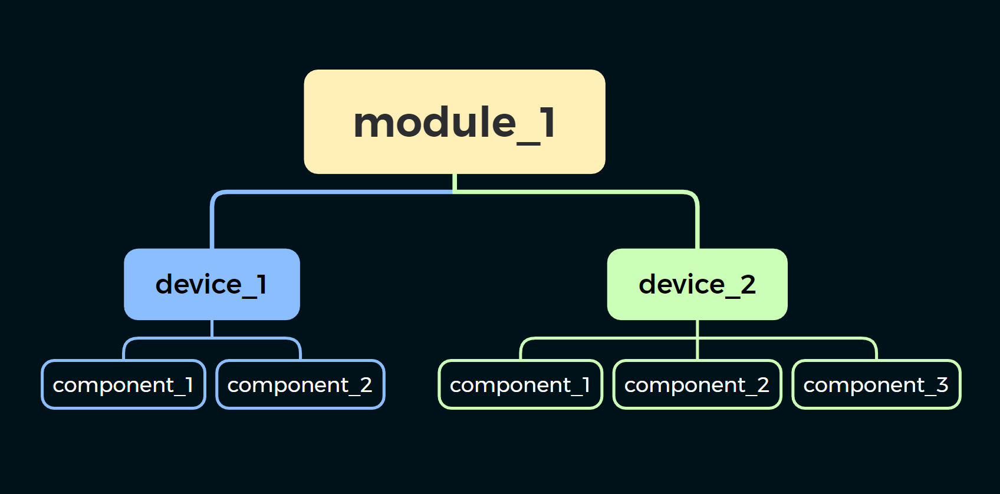
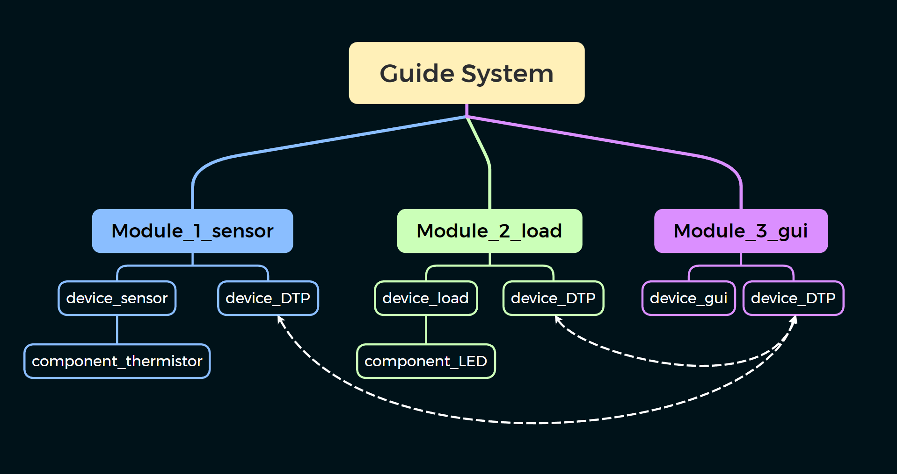
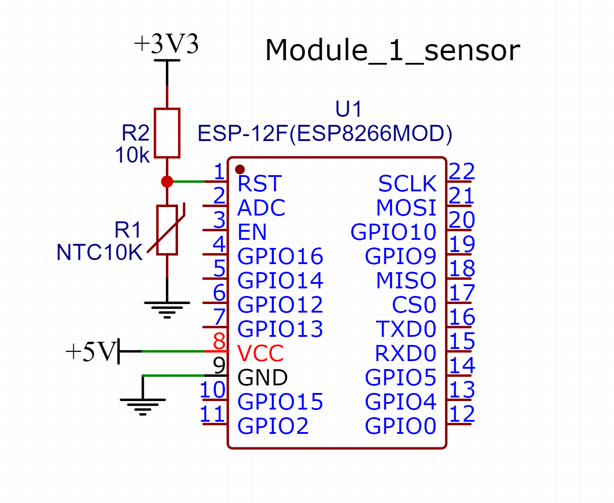
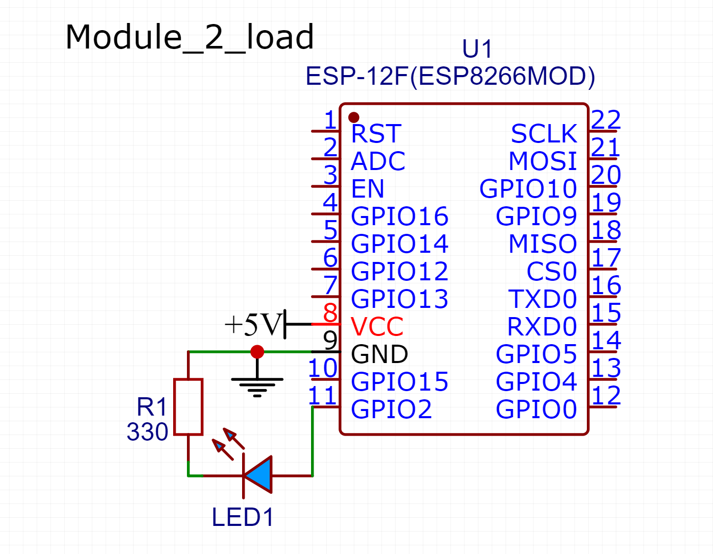

# Гайд по созданию системы

> “In theory there is no difference between theory and practice - in practice there is” — Yogi Berra
> “В теории, теория и практика неразделимы. На практике это не так” — Йоги Берра

В этой статье представлен пример практического использования **_SmartHomeSystem_**. Перед прочтением рекомендуется изучить основную документацию проекта, однако, если вы решили начать знакомство с **_SmartHomeSystem_** именно с этого гайда, то по мере прочтения вы найдете ссылки на материалы, которые пояснят возникающие вопросы.

## Содержание

- [Введение](#введение)
- [Анализ и проектирование системы](#анализ-и-проектирование-системы)
- [Аппаратная часть](#аппаратная-часть)
  - [Выбор компонентов](#выбор-компонентов)
  - [Разработка электрической схемы](#разработка-электронной-схемы)
- [Программная часть](#программная-часть)
  - [Подготовка ПО и сборка](#подготовка-по-и-сборка)
  - [Конфигурация системы](#конфигурация-системы)
  - [Подключение модулей к WiFi](#подключение-модулей-к-wifi)
  - [Настройка DTP](#настройка-dtp)
  - [Реализация модулей](#реализация-модулей)
  - [Разработка GUI](#разработка-gui)
    - [Backend](#backend)
    - [Frontend](#frontend)
    - [Скриншот приложения](#скриншот-приложения)

## Введение

Проектирование любой системы состоит из нескольких этапов:

1. Определение задач, которые будет выполнять система.
2. Выбор компонентов
3. Проектирование узлов и модулей
4. Сборка системы
5. Программирование поведения системы
6. Отладка и настройка

В этом гайде мы рассмотрим пример создания небольшой системы. Конечно, он не охватит все возможности **_SmartHomeSystem_**, но вполне наглядно покажет преимущества проекта.

## Анализ и проектирование системы

> “Simplicity is prerequisite for reliability” — Edsger W. Dijkstra

В первую очередь необходимо определиться с назначением проектируемой системы. Цель нашей системы — наглядно продемонстрировать возможности **_SmartHomeSystem_**. Хотя данная система не предназначена для решения конкретных практических задач, она покажет настройку и использование основных компонентов.

В **_SmartHomeSystem_**  выделяются три основных компонента, работу с которыми нам предстоит рассмотреть:

- **Load** (нагрузка) — абстракция, отвечающая за включение/выключение или плавное регулирование определенного устройства.
- **Sensor** (датчик) — отвечает за измерение показаний окружающей среды.
- **Data Transfer Protocol** (Протокол Передачи Данных) — набор инструментов для представления и передачи информации между компонентами системы.

Существуют и другие инструменты, однако в данном примере мы сосредоточимся на использовании только основных. Наша система будет состоять из трех _устройств_: датчика температуры, нагрузки и графического приложения. Последнее будет позволять управлять нагрузкой и просматривать показания датчика. Все три устройства будут размещены на трех отдельных _модулях_. Это не является обязательным, т.к. один модуль может состоять из нескольких устройств, но мы намеренно их разделим, чтобы продемонстрировать соединение _модулей_ в единую систему.

> [!NOTE]
> Стоит пояснить несколько терминов:
>
> - `Module` — узел системы **_SmartHomeSystem_**, связывающийся с другими по WiFi и запускающий внутри себя одно или несколько устройств.
> - `Device` — устройство системы **_SmartHomeSystem_**, отвечающее за выполнение определенной задачи (физической или виртуальной).
> - `Component` — неделимая составляющая. Под этим термином подразумевается класс, процесс, вычислительный блок или малое устройство (отдельный датчик, соединение, протокол...).
>
> 

Дадим обозначения нашим модулям:

1. `Module_1_sensor` — будет отвечать за датчик.
2. `Module_2_load` — нагрузка.
3. `Module_3_gui` — GUI (графический интерфейс пользователя).



## Аппаратная часть

> “For every problem, there is a solution that is simple, neat, and wrong” — H. L. Mencken

Теперь, когда мы знаем какие именно функции должна выполнять система и из каких частей она будет состоять, необходимо подобрать электронные компоненты и спроектировать модули.

### Выбор компонентов

#### Микроконтроллеры

В основе каждого модуля лежит вычислительный блок — микроконтроллер или компьютер. Для первого и второго модулей мы будем использовать ESP8266. Можно выбрать любой аналог из поддерживаемых микроконтроллеров с наличием WiFi: [см. документацию по микроконтроллерам](../Hardware/microcontrollers.md).

> [!TIP]
> Для удобства можно воспользоваться готовыми платами **NodeMCU** или **Wemos D1** — не придется паять лишней обвязки и использовать отдельный программатор.

`Module_3_gui` будет основан на персональном компьютере или ноутбуке. Также приложение можно собрать под мобильные устройства.

#### Датчик

Датчик в нашей системе будет измерять показания температуры, что обусловлено простотой и доступностью компонентов. Любой другой датчик, поддерживаемый **_SmartHomeSystem_**, подключается аналогично. Для его инициализации необходимо выбрать соответствующий класс, реализующий работу с интерфейсом датчика.

В качестве датчика температуры будет использоваться обычный терморезистор. Подробно узнать о нем и о других датчиках можно в [документации к датчикам](../Hardware/sensors.md).

#### Нагрузка

В качестве нагрузки мы не будем подключать дополнительные устройства. Ограничимся светодиодом, имеющимся на плате ESP8266. Он связан с портом `GPIO2`, на который, при необходимости, можно подключить полезную нагрузку.

> [!WARNING]
> GPIO микроконтроллеров рассчитаны только на логический сигнал. Для подключения нагрузки, требующей большого тока, необходимо использовать специальные силовые схемы. Ознакомиться с ними можно в [power_components.md](../Hardware/power_components.md).

### Разработка электронной схемы

Следующим шагом необходимо разработать принципиальную электрическую схему. Для этого следует использовать документацию от производителей (даташиты) и материалы из интернета. Некоторую информацию можно найти в документации к аппаратной части проекта [см. SHSdocumentation/Hardware](../Hardware/).

#### `Module_1`

В нашем случае мы подключаем к аналоговому порту (`ADC`/`A0`) первого микроконтроллера делитель напряжения, состоящий из термистора и подтягивающего резистора, номинал которого равен номиналу термистора в нормальных условиях.

В документации от производителя термистора необходимо найти следующие параметры

- `th_B` — бета-коэффициент термистора 1000 <= `th_B` <= 5000.
- `th_Temp` — базовая температура термистора.
- `th_R` — сопротивление термистора (в Om) при базовой температуре.

К термистору требуется подобрать балластный резистор с

- `res_R` — сопротивление балластного резистора (в Om).

> [!NOTE]
> Номинал балластного резистора обычно подбирается равным номиналу термистора при базовой температуре, т.е. `res_R ≈ th_R`.

Вышеперечисленные значения необходимы для инициализации датчика в программе.



#### `Module_2`

Для второго модуля требуется только подать питание на микроконтроллер, т.к. светодиод уже припаян на плате. Приведем схему, на случай, если планируется работать с другим микроконтроллером или платой.

> [!IMPORTANT]  
> Согласно схеме, поведение светодиода инвертировано: он загорается при подаче низкого уровня сигнала (`LOW`) и потухает при подаче высокого уровня (`HIGH`).

> [!WARNING]
> Пины ESP рассчитаны только на логический сигнал. Недопустимо подключать нагрузку, потребляющую более 15 mA. Следует использовать токоограничивающие резисторы.



## Программная часть

> “Talk is cheap. Show me the code.” ― Linus Torvalds

Наконец мы переходим к программным возможностям **_SmartHomeSystem_**.

### Подготовка ПО и сборка

Первым делом следует установить необходимые для работы среды разработки, утилиты и драйверы, а затем запустить подготовительную сборку проекта. После этого можно приступать к использованию **_SmartHomeSystem_**. Весь этап подробно описан в отдельном файле документации — [build_manual.md](build_manual.md)

### Конфигурация системы

Сначала необходимо создать конфигурацию системы, единую для всех модулей. С её помощью мы сможем удобно использовать идентификаторы модулей и устройств, избегая копирования файлов и кода, тем самым предотвращая возможные ошибки.

Создадим файл [gs_config.h](../../src/examples/guide_system/config.h), в котором укажем конфигурацию всех трех модулей в системе. Теперь, при его подключении в код нам будут доступны следующие константы:

```cpp
shs::config::Module_1_sensor::MODULE_ID;                   // value: 1
shs::config::Module_1_sensor::DevicesIDs::THERM_SENSOR;    // value: 1

shs::config::Module_2_load::MODULE_ID;                     // value: 2
shs::config::Module_2_load::DevicesIDs::LOAD;              // value: 1 

shs::config::Module_3_gui::MODULE_ID;                      // value: 3

```

Из этих констант составляются `shs::ID`, которые испольнуются в API. Например, для работы с нагрузкой `shs::ID` будет выглядеть так:

```cpp
shs::ID load_id(
    shs::config::Module_2_load::MODULE_ID,    // moduleID
    shs::config::Module_2_load::LOAD          // deviceID
                                              // componentID (default: 0)
    );
```

Т.к. в нашем примере device `load` состоит из одного компонента, то значение `componentID` следует оставить по умолчанию.

### Подключение модулей к WiFi

Нам необходимо подключить модули к WiFi-сети, чтобы можно было организовать передачу данных. Для этого в `SHScore` есть специальный класс `shs::ControlWiFi`.

Статическая функция `connectWiFi(ssid, pass)` запустит подключение к WiFi. В нашем случае выполнение какого-либо кода без налаженного WiFi-соединения будет бессмысленно, поэтому можно воспользоваться блокирующей функцией `connectWiFiWait(max_time, ssid, pass)`.

Давайте убедимся, что модулю удалось подключиться к WiFi. Для этого выведем отладочную информацию, используя `shs_debug.h`

> [!NOTE]
> Если имя сети и пароль указаны в файле настроек, то передавать аргументы в функцию необязательно. Подробнее см. [документация к ControlWiFi](../Code/SHScore_doc/shs_doc_ControlWiFi.md).

Создадим набросок в Arduino IDE или PlatformIO с следующим содержанием:

```cpp
#include <shs_ControlWiFi.h>

#define DEBUG
#include <shs_debug.h>


void setup()
{
    dinit();

    if (shs::ControlWiFi::connectWiFiWait()) doutln("Wi-Fi is successfully connected.");
    else                                     doutln("WiFi connection error.");
}

void loop() {}

```

Загрузим прошивку в микроконтроллеры и убедимся, что WiFi-соединения успешно установлены.

### Настройка DTP

Теперь нужно сделать так, чтобы устройство принимало и отправляло данные (запросы с других устройств). Для этого модуль должен уметь:

- Принимать и обрабатывать входящие клиенты.
- Подключаться как клиент к другим устройствам.
- Уметь находить другие модули **_SmartHomeSystem_** в сети.

Для этого в `SHScore` реализован `SHSDTP` — _Smart Home System Data Transfer Protocol_. Он состоит из нескольких компонентов, каждый из которых выполняет свою задачу.

Сначала необходимо создать объект класса `shs::DTP`. Он отвечает за связывание всех шин данных и обработку приходящих по ним сообщений с помощью обработчиков API. Чтобы принимать и обрабатывать входящие подключения, необходимо запустить TCP Server. Он реализован в классе `shs::TcpServer`. Серверу нужно передать ссылку на объект `shs::DTP`. При подключении нового клиента, сервер будет создавать "шину данных" и добавлять ее в хранилище DTP.

Чтобы устройства могли находить друг друга, не зная IP-адресов в локальной сети, разработан класс `shs::DTPdiscover`. Он посылает широковещательный UDP-запрос, на который отвечает искомое устройство, отправляя свой IP-адрес.

> [TIP]
> Вместо подключения всех файлов по отдельности можно воспользоваться их объединением. Достаточно подключить `<shs_DTP>` и `<shs_Network>`.

_Чтобы не загромождать код, был убран вывод отладочной информации._

```cpp
#include <shs_ControlWiFi.h>

#include <shs_DTP.h>
#include <shs_TcpServer.h>
#include <shs_DTPdiscover.h>


shs::DTP dtp(THIS_ID);
shs::TcpServer server(shs::settings::DEFAULT_TCP_PORT, dtp);
shs::DTPdiscover discover(THIS_ID);


void setup()
{
    shs::ControlWiFi::connectWiFiWait();
    
    dtp.start();
    server.start();
    discover.start();
}


void loop()
{
    dtp.tick();
    server.tick();
    discover.tick();
}
```

### Реализация модулей

Теперь, когда связь настроена, можно перейти к реализации отдельно каждого модуля.

#### `Module_1_sensor`

Для считывания показаний датчика с аналогового пина предназначен класс `shs::SensorAnalog`. Он считывает значение с АЦП, но не обрабатывает результат. Чтобы получить из показаний АЦП температуру, нужно выполнить специальные преобразования. В [SHSlibrary](../../src/SHSlibrary) для работы с термистором есть специальная библиотека. Класс `shs::Thermistor` наследуется от `shs::SensorAnalog`, при этом он проводит все необходимые вычисления и возвращает готовую температуру.

В коде создадим объект термистора, передав в него характеристики используемого компонента, которые мы ранее посмотрели в даташите. Сразу подключим к нему API, чтобы другие устройства могли запрашивать и получать результаты измерений.

> [!NOTE]
> В качестве датчика не обязательно использовать термистор, можно подключить цифровую микросхему. Чтобы подружить её с **_SmartHomeSystem_**, достаточно воспользоваться классом, реализующим интерфейс для взаимодействия с микросхемой. Если используется неподдерживаемый **_SmartHomeSystem_** датчик, необходимо дописать класс для работы с ним самостоятельно, унаследовав его от `shs::Sensor` (или `shs::SensorAnalog`) и переопределив нужные функции.
>

Добавим к коду прошивки Module_1_sensor следующий код:

```cpp
#include <memory>

#include <shs_lib_Thermistor.h>
#include <shs_Sensor_API.h>

// A0 — the pin to which the sensor is connected
// res_R = 10'000
// th_B = 3435
shs::Thermistor temp_sensor(A0, 10'000, 3435);
    
// in setup:
dtp.attachAPI(shs::make_unique<shs::Sensor_API>(temp_sensor, shs::ID(THIS_ID, TEMP_SENSOR_ID), dtp));
    
```

#### `Module_2_load`

Для управления нагрузкой в режиме `SWITCH` (вкл/выкл), аналогично датчику, предоставляется класс `shs::LoadSwitch`. Т.к. поведение светодиода инвертировано, будем использовать `shs::LoadSwitchReversed`. 

> [!TIP] При необходимости плавного регулирования следует использовать `shs::LoadPWM`.

Добавим в код прошивки Module_2_load следующие строки:

```cpp
#include <memory>

#include <shs_LoadSwitch.h>
#include <shs_Load_API.h>

shs::LoadSwitch load(LED_BUILTIN);

// in setup:
dtp.attachAPI(std::make_unique<shs::Load_API>(load, LOAD_ID));

```

#### `Module_3`

Создание GUI-приложения — задача посложнее. Парой строчек кода обойтись не получится, поэтому реализации третьего модуля посвящен отдельный раздел, следующий ниже.

### Разработка GUI

Для создания приложения будем использовать библиотеку Qt и родную для нее IDE — QtCreator. Более подробно ознакомиться с Qt и научиться писать приложения можно в книге Макса Шлее "Qt5.10. Профессиональное программирование на C++". В данном разделе не будут приводиться подробные объяснения кода Qt, не касающиеся **_SmartHomeSystem_**.

Приложение написано с использованием технологии QtQuick. За бэкенд отвечает класс-движок на С++. Фронтенд использует язык QML. Для удобной интеграции **_SmartHomeSystem_** и Qt разработано вспомогательное ядро [SHSqt_core](../../src/SHSqt_core).

#### Backend

Создадим класс-движок нашего приложения, который будет предоставлять весь необходимый функционал. Ниже приведено объявление класса с основными элементами. Подробную реализацию можно посмотреть в [GUIapp](../../src/examples/guide_system/module_3/GUIapp).

---

Поскольку классы **_SmartHomeSystem_** рассчитаны на работу с паттерном event loop (цикл событий), они требуют постоянного вызова метода `tick()`. Для этого настраивается встроенный в класс `QObject` таймер, по сигналу которого происходят все необходимые опросы.

Для взаимодействия с **QML** в классе объявлены свойства и сигналы. Таким образом, изменения состояний управляемых объектов будут отображаться в графической части.

---

В классе, аналогично предыдущим модулям, созданы два объекта связи:

- `m_discover` отвечает за поиск устройств в сети по ID.
- `m_dtp` связывает шины данных (в нашем случае TCP-соединения), API и виртуальные инструменты.

При запуске приложения происходит попытка найти модули в сети и подключиться к ним. Если подключение состоялось, отправляется соответствующий сигнал `sensorConnectionSignal()` или `loadConnectionSignal()`, который затем отлавливается в части фронтенда.

---

Для получения показаний с датчика и управления нагрузкой созданы виртуальные объекты:

- `m_sensor` — объект виртуального датчика, использующий инструмент `shs::SensorVirtual`, который предоставляет удаленный доступ к датчику с интерфейсом взаимодействия, наследованным от `shs::Sensor`.
Датчик обновляется по таймеру `m_sens_timer`. После получения данных отправляется сигнал `sensorUpdated`.
- `m_load` — объект виртуальной нагрузки, использующий инструмент `shs::LoadVirtual`, который предоставляет удаленное управление нагрузкой с интерфейсом взаимодействия, наследованным от `shs::Load`.

---

<details><summary><b><u>See code</u></b></summary>

```cpp
class Engine : public QObject
{
    Q_OBJECT
public:
    explicit Engine(QObject* parent = nullptr)
    : QObject(parent),
    m_dtp(THIS_ID), m_discover(THIS_ID),
    m_load(THIS_ID, LOAD_ID, m_dtp), m_sensor(THIS_ID, SENSOR_ID, m_dtp)
    {
        start();
    }

    ~Engine() = default;

    void start();
    void tick();
    void stop() {}


    Q_INVOKABLE double   getSensorValue() { return m_sensor.getValueD(); }
    Q_INVOKABLE bool getSensorConnected() { return m_sensor_connected; }
    Q_INVOKABLE bool   getLoadConnected() { return m_load_connected; }

signals:
    void sensorUpdated();
    void sensorConnectionSignal();
    void loadConnectionSignal();

public slots:
    void onSwitchToggled(bool checked) { checked ? m_load.on() : m_load.off(); }
    void timerEvent([[maybe_unused]] QTimerEvent* event) override { tick(); }

private:
    Q_PROPERTY(double sensorValue READ getSensorValue NOTIFY sensorUpdated);
    Q_PROPERTY(bool sensorConnected READ getSensorConnected NOTIFY sensorConnectionSignal);
    Q_PROPERTY(bool loadConnected READ getLoadConnected NOTIFY loadConnectionSignal);

    bool m_checkModuleConnection(const shs::t::shs_ID_t moduleID);

    static constexpr auto THIS_ID = shs::config::Module_3::MODULE_ID;
    static constexpr auto LOAD_ID = shs::t::shs_ID_t(shs::config::Module_2::MODULE_ID, shs::config::Module_2::LOAD);
    static constexpr auto SENSOR_ID = shs::t::shs_ID_t(shs::config::Module_1::MODULE_ID, shs::config::Module_1::THERM_SENSOR);
    static constexpr shs::t::shs_port_t PORT = shs::settings::DEFAULT_TCP_PORT;

    shs::DTP m_dtp;
    shs::DTPdiscover m_discover;

    shs::LoadVirtual m_load;
    bool m_load_connected{};

    shs::SensorVirtual m_sensor;
    bool m_sensor_connected{};

    shs::ProgramTime m_check_connection_timer;
    shs::ProgramTime m_sens_timer;
    bool m_sens_update{};
};

```

</details>

#### Frontend

Для создания виджетов в **_SmartHomeSystem_** подготовлена основа — [SHSqml_core](../../src/SHSqt_core/SHSqml_core).

Для каждого виджета задаются свойства `moduleName` — имя соответствующего модуля и `isConnected` — статус соединения. При успешном подключении, виджет помечается _connected_.

Помимо виджетов, создается объект класса-движка (`SHSengine`). Его слоты настраиваются на изменение виджетов.

<details><summary><b><u>See code</u></b></summary>

```qml
import QtQuick 2.12
import QtQuick.Window 2.12
import QtQuick.Controls 2.12
import QtQuick.Controls.Material 2.12
import QtQuick.Controls.Styles 1.4
import QtQuick.Layouts 1.12

import SHSengine 1.0
import "./SHSbuild/SHSqt_core/SHSqml_core"


ApplicationWindow {
    visible: true

    width: 640
    height: 480
    property int defMargin: 20
    minimumWidth: columnLayout.implicitWidth + 2*defMargin
    minimumHeight: columnLayout.implicitHeight + 2*defMargin

    title: qsTr("Smart Home System")
    Material.theme: Material.Dark
    Material.background: "#001219"


    ColumnLayout {
        id: columnLayout
        anchors.centerIn: parent
        anchors.fill: parent
        spacing: defMargin / 2


        Load {
            id: load
            Layout.fillWidth: true
            Layout.margins: defMargin

            onChanged: shs_engine.onSwitchToggled(checked)
        }

        Sensor {
            id: sensor
            Layout.fillWidth: true
            Layout.margins: defMargin
        }

        Item {
            Layout.fillHeight: true
            Layout.minimumWidth: 280
        }
    }

    SHSengine {
        id: shs_engine
        onSensorUpdated: sensor.value = sensorValue
        onSensorConnectionSignal: sensor.isConnected = sensorConnected
        onLoadConnectionSignal: load.isConnected = loadConnected
    }
}
```

</details>

#### Скриншот приложения


