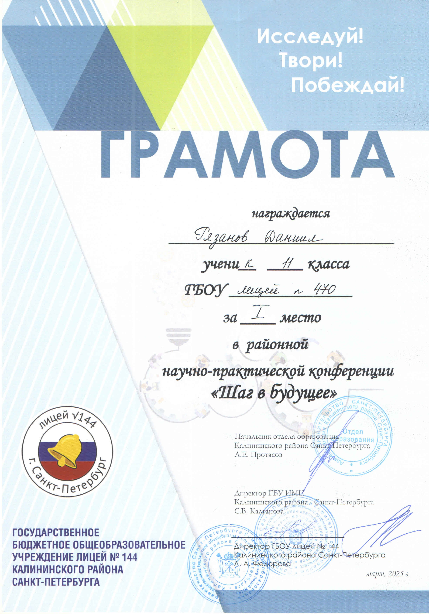

# Достижения и награды SmartHomeSystem

## 2 место в Всероссийском конкурсе open source проектов

## 1 место в хакатоне "Умный Петербург 2025"

[SmartBank](https://github.com/MrRyabena/SmartBank), созданная на хакатоне "Умный Петербург 2025" как решение кейса от Санкт-Петербургского политехнического университета Петра Великого, заняла первое место в треке "Интернет вещей". За 2 дня были смоделирован и напечатан корпус, собрана электроника, написан программный код и отлажен механизм распознавания монет.

## 1 место в районной научно-практической конференции "Шаг в будущее"

Проект **_SmartHomeSystem_**, по итогам конференции, был награжден грамотой за 1 место.

